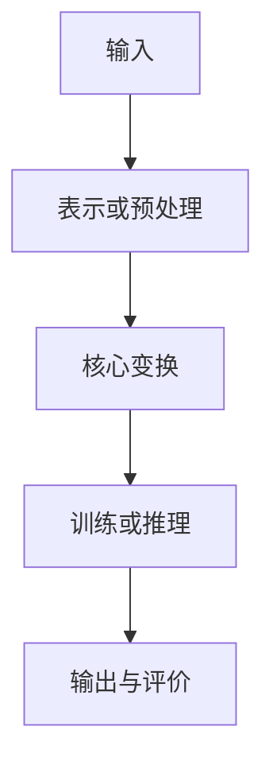

# 重点研读

<!-- 第三遍围绕第二遍留下的问题深入研读，达到能够复述论文、解释方法、分析证据、评估局限并思考复现或改进的程度。 -->
## 核心理解

**论文通过……解决……；其关键成立条件是……，实验或理论证据是……。**

## 问题知识

### 研究问题

<!-- 明确本节要解决的研究问题，以及理解后续方法所需的前置知识。 -->
### 前置知识

1、

2、

## 数据流程

<!-- 还原从输入、表示或预处理、核心变换、训练或推理到输出与评价的完整数据流。 -->

## 逐节分析

### [章节或模块]

**本节作用：……**

<!-- 逐节说明作者在本节要回答的问题，并写清输入、变换、输出及其与前后部分的接口。 -->
- 输入：
- 处理：
- 输出：
- 与前后部分的关系：
- 关键公式、算法或实现：
- 我的解释：

## 实验理论

<!-- 对实验说明问题、设置、对比、结果、证据强度和可能的替代解释；对理论说明假设、推导作用和结论。 -->
- 实验问题：
- 数据、设置或假设：
- 对比方法：
- 主要结果：
- 结果如何支持论文结论：
- 可能的替代解释：

## 复现改进

<!-- 分析复现所需条件、实现难点、可改进的实验或方法，以及可迁移到其他问题的部分。 -->
- 复现所需条件：
- 可能的实现难点：
- 可以改进的实验：
- 可以改进的方法：
- 可迁移到其他问题的部分：

## 最终理解

### 论文创新

### 论文局限

### 研究启发

### 未决问题
