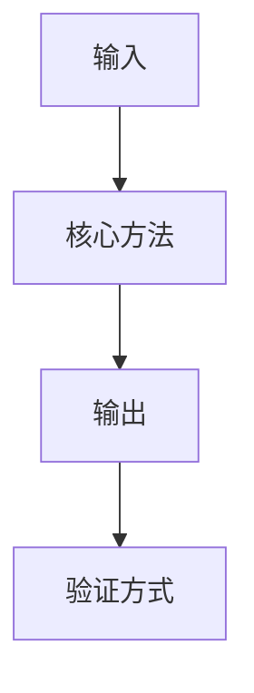
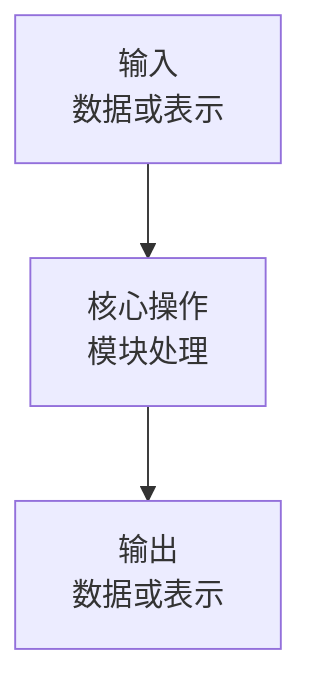

# 数据流

<!-- 第二遍完整浏览论文，建立全局地图；暂不追求证明所有公式或解决所有实现细节。按论文顺序确认章节任务、方法全貌、关键图表、方法对比、引用文献和未解决问题。 -->

## 核心概括

> [!note]
>
> **这篇论文从……出发，通过……解决……，最后用……验证……。**


## 论文结构

<!-- 说明每个部分的主要内容，以及它在全文中承担的作用。可以直接用 paperCheck.py 生成的元数据中的 sections 改写 -->

| 部分 | 内容 | 作用 |
|---|---|---|
|  |  |  |

## 整体流程

<!-- 用流程图梳理从输入到输出的主要数据流，并标出验证方式。优先 graph TB -->



## 模块流程

<!-- 按数据流顺序说明每个模块的输入、核心操作、表示变化、输出，以及与前后模块的关系。说明可以结合论文公式、伪代码或代码实现；必要时标注向量、矩阵或张量的形状和维度。凡是能够通过代码清晰表达的实现，必须给出实际代码，不得仅用概念说明或伪代码替代。 -->

### 模块一：[模块名称]

<!-- 模块名称不要出现各种括号，且各个模块的标题应当规整对齐 -->

<!-- 用一张小型流程图和一张对照表，说明本模块如何改变数据；内容可结合论文公式、伪代码或代码实现。凡是能够编写代码实现的操作，必须提供可运行或接近可运行的实际代码；只有在论文信息不足以合理实现时，才允许省略代码，并说明原因。 -->

> [!流程] 模块作用
> [用一句话说明本模块在整个方法中的作用]



| 项目 | 内容 |
|---|---|
| 输入 | [数据、格式、形状或维度] |
| 操作 | [核心计算或处理步骤] |
| 输出 | [数据、格式、形状或维度] |
| 关系 | [与前后模块的连接方式] |

$$
[公式演示，如果需要]
$$

```[language_type]
[代码实现；凡可用代码表达时必须提供，不能仅写伪代码，控制长度]
```

## 训练验证

<!-- 说明训练、推理或实验验证流程，以及评价指标如何对应方法输出。 -->
- 训练流程：
- 推理流程：
- 验证方式：
- 评价指标：

## 关键图表

### [编号或标题]

[]([填写图表地址；本地图片由编排方在写作后统一运行 `.codex/skills/paper-to-notes/scripts/moveMarkdownImages.py` 复制到当前笔记目录的 `assets/` 中，并自动更新 Markdown 路径])

<!-- 解释关键图表的展示对象、主要元素、比较关系和支持的结论；暂时无法理解的地方单独记录。 -->

- 展示什么：
- 主要元素：
  - [元素1]：[表示了 ... ...]
  - [元素2]：[表示了 ... ...]

- 支持观点：

## 方法对比

<!-- 对比代表性基线与论文方法的做法、优点、局限，以及它们与本文的关系。 -->
| 对象 | 内容 | 优点 | 局限 |
|---|---|---|---|
| 基线方法 |  |  |  |
| 论文方法 |  |  |  |

## 边界条件

<!-- 记录方法依赖的输入、假设、适用场景和可能失效的场景。 -->
- 输入条件：
- 关键假设：
- 适用范围：
- 失效情况：

## 思考点

<!-- 针对梳理过程中可能存在的难点值得思考的点进行记录，留给第三部分-->
