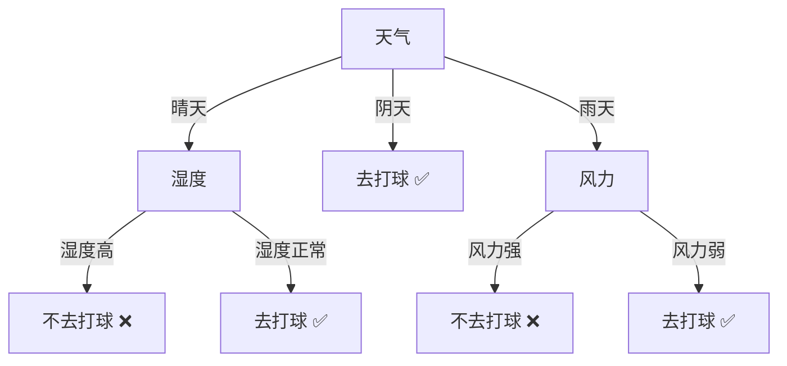

# 基本流程

决策树（Decision Tree）是一种基于树形结构的监督学习算法。它通过对数据集中特征（属性）进行一系列 If-Then 的条件判断，将样本分配到不同的分支中，最终在叶子节点上输出预测结果。



如上，一棵决策树一般包含一个根节点、若干内部节点和若干叶节点。叶子节点对应于决策结果，其他每个节点则对应于一个属性测试；每个节点的样本集合根据属性测试结果被划分到子节点中；根节点包含所有样本。

决策树的生成与训练是一个递归的过程。在决策树的基本算法中，会出现三种情况导致递归返回：
- 当前节点包含的样本全属于同一个类别。
- 当前属性集为空，或是所有样本在所有属性上取值相同，无法划分。
- 当前节点包含的样本集合为空，不能划分。

具体流程，如下：
```python
def TreeGenerate(D, A):
    # 情况1：纯样本
    if all(same class in D):
        return leaf(class = majority(D))
    
    # 情况2：无法再分
    if A is empty or all samples identical on A:
        return leaf(class = majority(D))
    
    # 选择最优属性并分裂
    a* = select_best(A, D)
    
    for each value v in a*:
        D_v = {样本 in D | 样本[a*] == v}
        if D_v is empty:
            branch = leaf(class = majority(D))
        else:
            branch = TreeGenerate(D_v, A \ {a*})
        add branch to node
    
    return node
```
# 特征选择

## 熵
在信息论与概率统计中，嫡（entropy）是表示随机变量不确定性的度量。设 X 是一个取有限个值的离散随机变量，其概率分布为：
$$
P(X = x_i) = p_i, i = 1, 2, \cdots, n
$$
则随机变量 X 的熵定义为：
$$
H(X) = -\sum_{i=1}^n p_i \log p_i
$$
熵越大，随机变量的不确定性就越大，包含的信息就越多。从定义可验证：
$$
0 \leq H(p) \leq \log n
$$
## 条件熵
条件熵（conditional entropy）表示在已知随机变量 $X$ 的条件下，随机变量 $Y$ 的不确定性。设有随机变量 $(X, Y)$，其联合概率分布为：
$$
P(X = x_i, Y = y_j) = p_{ij}, \quad i = 1, 2, \cdots, n,\; j = 1, 2, \cdots, m
$$
条件熵 $H(Y|X)$ 表示在已知随机变量 $X$ 的条件下随机变量 $Y$ 的不确定性。
$$
H(Y|X) = \sum_{i=1}^{n} p_i H(Y|X = x_i)
$$
其中：
$$
p_i = P(X = x_i), \quad i = 1, 2, \cdots, n
$$
>[!note]
>当熵和条件熵中的概率由**数据估计**（特别是极大似然估计）得到时，所对应的熵与条件熵分别称为经验熵（empirical entropy）和经验条件熵（empirical conditional entropy）。此时，如果有 0 概率，令 $0 \log 0 = 0$。

## 信息增益
特征 $A$ 对训练数据集 $D$ 的**信息增益** $g(D, A)$，定义为集合 D 的经验熵 $H(D)$ 与特征 $A$ 给定条件下 $D$ 的经验条件熵 $H(D|A)$ 之差，即
$$
g(D, A) = H(D) - H(D|A) \tag{5.6}
$$
一般地，熵 $H(Y)$ 与条件熵 $H(Y|X)$ 之差称为互信息（mutual information）。决策树学习中的信息增益等价于训练数据集中类与特征的互信息。

根据信息增益准则的特征选择方法是：对训练数据集（或子集）$D$ ，计算其每个特征的信息增益，并比较它们的大小，选择信息增益最大的特征。
## 信息增益比
以信息增益作为划分训练数据集的特征，存在偏向于选择取值较多的特征的问题。使用信息增益比（information gain ratio）可以对这一问题进行校正，这是特征选择的另一准则。

特征 $A$ 对训练数据集 $D$ 的信息增益比 $g_{R}(D,A)$ 定义为其信息增益 $g(D,A)$ 与 训练数据集 $D$ 关于特征 $A$ 的值的熵 $H_{A}(D)$ 之比，即：
$$
g_{R}(D,A) = \frac{g(D,A)}{H_{A}(D)}
$$
其中：
$$
H_A(D)=-\sum_{i=1}^n\frac{|D_i|}{|D|}log_2\frac{|D_i|}{|D|}
$$
结合一个案例进行各个特征指标的计算说明，数据集如下：

| 序号  | 天气  | 湿度  | 风力  | 是否打球 |
| --- | --- | --- | --- | ---- |
| 1   | 晴天  | 高   | 强   | 否    |
| 2   | 晴天  | 高   | 弱   | 否    |
| 3   | 晴天  | 正常  | 弱   | 是    |
| 4   | 阴天  | 高   | 弱   | 是    |
| 5   | 阴天  | 正常  | 强   | 是    |
| 6   | 雨天  | 高   | 强   | 否    |
| 7   | 雨天  | 高   | 弱   | 否    |
| 8   | 雨天  | 正常  | 弱   | 是    |
| 9   | 雨天  | 正常  | 强   | 否    |
| 10  | 阴天  | 高   | 强   | 是    |
熵的计算，出去打球的概率为 0.5，不出去打球的概率也为 0.5：
$$
H(D) = -\frac{5}{10}\log_2\frac{5}{10} - \frac{5}{10}\log_2\frac{5}{10} = 1
$$
对特征“天气”的信息增益计算如下：

| 取值  | 样本数 |  是  |  否  |   熵   |
| :-: | :-: | :-: | :-: | :---: |
| 晴天  |  3  |  1  |  2  | 0.918 |
| 阴天  |  3  |  3  |  0  |   0   |
| 雨天  |  4  |  1  |  3  | 0.811 |
天气的条件熵如下：
$$
H(D|天气) = \frac{3}{10} \times 0.918 + \frac{3}{10} \times 0 + \frac{4}{10} \times 0.811 = 0.5998
$$
天气特征带来的信息增益如下：
$$
g(D|天气) = 1 - 0.5998 = 0.4002
$$
同理可以得到“湿度”、“风力”带来的信息增益分别为 0.1248 和 0.029，汇总如下：

| 特征  |    信息增益    |
| :-: | :--------: |
| 天气  | **0.4002** |
| 湿度  |   0.1248   |
| 风力  |   0.029    |

| 特征  |   信息增益比    |
| :-: | :--------: |
| 天气  | **0.2548** |
| 湿度  |   0.1285   |
| 风力  |   0.0290   |
因此，选择 **天气** 作为根节点
## 基尼指数
分类问题中，假设有 $K$ 个类，样本点属于第 $k$ 类的概率为 $p_0$ ，则概率分布的基尼指数定义为：
$$
Gini(p) = \sum_{k=1}^{K}p_k(1-p_k)=1-\sum_{k=1}^{K}p_{k}^2
$$
对于二类分类问题，若样本点属于第 1 类的概率是 $p$，则概率分布的基尼指数为：
$$
\text{Gini}(p) = 2p(1 - p) \tag{5.23}
$$
对于给定的样本集合 $D$ ，其基尼指数为：
$$
\text{Gini}(D) = 1 - \sum_{k=1}^K \left( \frac{|C_k|}{|D|} \right)^2 \tag{5.24}
$$
如果样本集合 $D$ 根据特征 $A$ 是否取某一可能值 $a$，被分割成 $D_1$ 和 $D_2$ 两部分，即
$$
D_1 = \{(x, y) \in D \mid A(x) = a\}, \quad D_2 = D - D_1
$$
则在特征 $A$的条件下，集合 $D$ 的基尼指数定义为
$$
\text{Gini}(D, A) = \frac{|D_1|}{|D|} \text{Gini}(D_1) + \frac{|D_2|}{|D|} \text{Gini}(D_2) \tag{5.25}
$$
基尼指数 $\text{Gini}(D)$ 表示集合 $D$的不确定性，基尼指数 $\text{Gini}(D, A)$ 表示经 $A = a$ 分割后集合 $D$ 的不确定性。基尼指数值越大，样本集合的不确定性也就越大，这一点与熵相似。
# 树的生成
## ID3
ID3算法的核心是在决策树各个结点上应用信息增益准则选择特征，递归地构建决策树。
## C4.5
C4.5算法与ID3算法相似，C4.5算法对ID3算法进行了改进。C4.5在生成的过程中，用信息增益比来选择特征。
## CART
# 剪枝处理

决策树生成算法通过递归划分，通常能对训练数据达到很高的分类准确率。但这样生成的树往往过于复杂，对未知的测试数据分类效果不佳，即出现**过拟合**。

因为其在生成过程过度追求训练数据的正确分类，导致树结构过于复杂。**解决方法**：对已生成的决策树进行简化，即**剪枝（pruning）**。
## 预剪枝
## 后剪枝