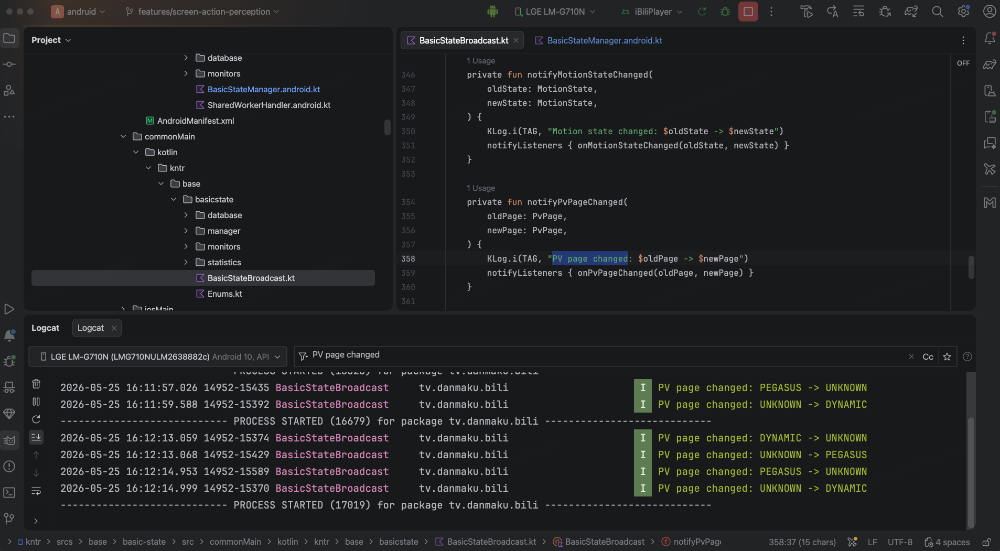

# 2026-05-15

> [!note]
> 
> 1. Kotlin 语言学习
> 	1. Kotlin 常用关键字，hard keyword & soft keyword
> 	2. Kotlin 特殊类学习了解：数据类、密封类、枚举类、object
> 2. 设计模式学习
> 	1. 理解观察者模式、策略模式
> 	2. 了解装饰器模式
> 3. `behavior-prediction` 源码阅读
> 	1. 仔细阅读 `VideoQualityPredictor.kt` 文件。梳理数据在实际清晰度预测中的走向：依据**设备行为信息标签**和**视频稿件标签**进行预测：
> 		1. **设备行为信息标签**从设备行为信息转换而来，设备行为信息固化在本地，从本地设备恢复、远端服务器，用户新的操作这三个源头转化、合并、覆盖而来。
> 		2. **视频稿件标签**存储在硬盘中，需要时取出使用。
> 		3. 该部分的 predict 函数直接依据两个 tag 进行预测，lstm 的运算则是在 update 操作中进行的。
> 	2. 阅读该模块下的 `file` 文件夹，对各个常用的数据类的内容和用途有所了解。
> 
> TODO：`behavior-prediction` 源码阅读
> 1.  AutoTendencyPredictor 相关部分
> 2. PlaySession 相关部分
> 

# 2026-05-18

> [!note]
> 
> 进行用户屏幕操作行为感知的初步设计
> - 屏幕操作记录的数据类设计
> - 缓存设计：基于双端队列实现的 FIFO 缓存队列
> - 高层信息策略初步构想
> 
> 未来开发流程：三步走
> 1. **实现有没有屏幕操作的判断**
> 2. 实现是什么屏幕操作的判断
> 3. 实现高层信息的提取
> 
> 
> TODO：
> 1. 初步实现有没有屏幕操作的判断逻辑，放在`kntr/srcs/base/basic-state`模块内，`参考PvStateMonitor` 模块实现
> 2. 实现个人设备上的调试，日志输出

****
# 2026-05-19

> [!note]
>
> 掌握 `kntr/srcs/base/basic-state` 模块的调用逻辑，可以在真机设备上输出日志

# 2026-05-20

> [!note]
>
> 掌握 `kntr/srcs/base/basic-state` 模块的调用逻辑，可以在真机设备上输出日志

# 2026-05-21

> [!note] 
> 

目标：实现对于有无触摸事件的感知模块开发
步骤：
- [ ] 1：未添加触摸感知功能时的 `apk` 包能在真机上运行，使用 `catlog` 抓取页面切换日志
	- [x] 1.1：拉取最新的远端仓库代码
	- [x] 1.2：云编译得到产物
	- [ ] 1.3：真机安装运行
- [ ] 2：阅读原本有的开发模块，了解当前模块逻辑
	- [ ] 2.1：
	- [ ] 2.2：
	- [ ] 2.3：
- [ ] 3：新模块开发，保持与现有检测模块设计逻辑一致

**1 问题 - 解决：**
debug 安装包无法正常在安卓真机上运行。 
- 抓取 catlog 日志查看详情

# 2026-05-22

> [!note] 
> 

目标：实现对于有无触摸事件的感知模块开发
步骤：
- [x] 1：未添加触摸感知功能时的 `apk` 包能在真机上运行，使用 `catlog` 抓取页面切换日志
	- [x] 1.1：拉取最新的远端仓库代码
	- [x] 1.2：~~云编译得到产物~~  Fawkes 打包出产物
	- [x] 1.3：真机安装运行
- [ ] 2：阅读原本有的开发模块，了解当前模块逻辑
	- [ ] 2.1：安卓操作系统了解学习，掌握相关 api 接口
	- [ ] 2.2：kotlin 并发编程学习
	- [ ] 2.3：梳理现有模块设计模式
- [ ] 3：新模块开发，保持与现有检测模块设计逻辑一致

**1 问题 - 解决：**

从云编译得到的 debug 安装包无法正常在安卓真机上运行。 
用 fafawkes 平台打包得到的 debug 包成功运行，如下：


**知识点1: CI/CD**

CI — 持续集成            
  - 代码推送后自动触发：构建、lint、测试
  - 尽早发现问题，避免集成地狱                                                  
CD — 持续部署/交付
  - 交付（Delivery）：自动构建产物，手动触发部署                                
  - 部署（Deployment）：通过所有检查后自动上线

**知识点2: bbgit 常用指令**

```shell
bbox-cli mono status

./bbgit status

./bbgit -b checkout <YOUR REMOTE BRANCH HERE>

./bbgit add .

./bbgit commit -m "<YOUR MESSAGE HERE>"

./bbgit push origin <YOUR REMOTE BRANCH HERE>

./bbgit pull origin <YOUR REMOTE BRANCH HERE>

git pull --rebase origin <YOUR REMOTE BRANCH HERE> 
```

# 2026-05-25

> [!note] 
>抢场地脚本
> - [ ] 添加破解滑块验证按钮功能：脚本端、插件端
> - [ ] 修复插件端界面刷新时，插件界面丢失功能
> - [ ] 添加插件端更好的日志输出

目标：实现对于有无触摸事件的感知模块开发
步骤：
- [x] 1：未添加触摸感知功能时的 `apk` 包能在真机上运行，使用 `catlog` 抓取页面切换日志
	- [x] 1.1：拉取最新的远端仓库代码
	- [x] 1.2：~~云编译得到产物~~  Fawkes 打包出产物
	- [x] 1.3：真机安装运行
- [ ] 2：阅读原本有的开发模块，新模块开发
	- [ ] 2.1：查看已有信息流的输入输出。成果：真机上的信息流的输入输出查看与截图
	- [ ] 2.2：学习查看 commonMain 的设计共性。成果：完成 commonMain 部分设计
	- [ ] 2.3：学习查看 androidMain 的硬件调度。成果：完成 androidMain 部分设计


一句话概括数据的流向：**数据从 Flow 产出立刻广播，之后存入内存。定期落盘 Room DB （小型 sql ），且定时从 Room DB 读取聚合，上报远端。** 逐步查看，[使用 debug 模式](https://info.bilibili.co/display/mt/025+Debug+Apk)，断点查看：
- [x] 广播打印
- [x] 内存查看
- [ ] Room DB 查看
- [ ] 远端查看

```shell
adb shell am start -D -n tv.danmaku.bili/.MainActivityV2
# 启动 app 命令
```

Debug 功能正常：

> [!note]
> 红色圆圈：行断点
> 红色眼睛：观察点

在如下路径：

```
/Users/bilibili/andruid/gripper/app/src/main/java/com/bilibili/gripper/buildvars/BuildVarsTask.kt
```

第 54 行 execute 方法入口，断点打在第 55 行 var debug = f.debug 就行，因为这是 app 启动的必经之路。


但是在所负责的模块中打断点就无法中断，同时观察到所期待的输出 `KLog.i(TAG, "PV page changed: $oldPage -> $newPage")` 也没有，按道理当切换 app 页面的时候通过 logcat 应该可以抓取其日志输出，初步判断是这个功能没有打开，即：
- 断点打在了未执行的路径 — 比如 `launchBasicStateCollector` 受 DD 开关控制，开关没开就不会走进去。

解决方案：
- 内置的 Compose 调试工具，如下操作。
- Fawkes 后台下发 ，切换到测试环境，登陆这个[网站](https://fawkes.bilibili.co/#/device-decision/list?app_key=android64&env=prod&pn=1)，**一定要打开手机的网络，不然无法及即时更新！**
- ~~代码里强制修改值，但是需要重新编译成本高。~~


解决如下，出现对应 pv page changed 的日志，证明确实是远端 DD 按钮未开：



对于写入内存的观察和写入硬盘的观察，**先梳理数据流向**，仅仅针对 PV page 的信息流打上断点，同时开启 android 的内存和硬盘检测工具进行同步观察。


当 `logcat` 捕捉到了日志时，对应的 `debug` 断点处也出现了变化，查阅 `Enum.kt` 文件，这里的 `dt.dt.0.0.pv` 为 `DYNAMIC` 动态页面，因此符合预期。

# 2026-05-26

> [!note]
> 目标：实现对于有无触摸事件的感知模块开发
> 步骤：
> - [x] 1：未添加触摸感知功能时的 `apk` 包能在真机上运行，使用 `catlog` 抓取页面切换日志
> 	- [x] 1.1：拉取最新的远端仓库代码
> 	- [x] 1.2：~~云编译得到产物~~  Fawkes 打包出产物
> 	- [x] 1.3：真机安装运行
> - [x] 2：阅读原本有的开发模块，新模块开发
> 	- [x] 2.1：查看已有信息流的输入输出。成果：真机上的信息流的输入输出查看与截图
> 	- [x] 2.2：学习查看 commonMain 的设计共性。成果：完成 commonMain 部分设计
> 	- [x] 2.3：学习查看 androidMain 的硬件调度。成果：完成 androidMain 部分设计
> - [ ] 3： 代码框架梳理提交与合并 ，代码修改

针对 ScreenAction 相关的数据类有两个，一个是 androidMain 里面之间传出的原始数据，一个是 commonMain 里统一的 `BasicStateEntiy` 数据。

```kotlin
// BasicStateEntity 的格式如下：
data class BasicStateEntity(  
    val id: Long = 0,  
    val timestamp: Long,  

    val name: Int,  // state field name
    val value: String,  // value string
)
```

在 `StateField.kt` 中相关的代码如下：

```kotlin 
SCREEN_ACTION(110, "Screen Action")
```

在 `Enums.kt` 中相关的代码如下：

```kotlin
enum class ScreenAction {  
	/**  
	 * 未知场景  
	 */  
	UNKNOWN,  
	  
	/**  
	 * 触摸开始  
	 */  
	TOUCH_BEGIN  
	  
	/**  
	 * 触摸结束  
	 */  
	TOUCH_END  
	  
	/**  
	 * 点击  
	 */  
	TAP,  
	  
	/**  
	 * 双击  
	 */  
	DOUBLE_TAPß,  
	  
	/**  
	 * 长按  
	 */  
	LONG_PRESS,  
	  
	/**  
	 * 横向滑动  
	 */  
	SCROLL_HORIZONTAL,  
	  
	/**  
	 * 竖向滑动  
	 */  
	SCROLL_VERTICAL,  
	  
	/**  
	 * 快速甩动  
	 */  
	FLING,  
	  
	/**  
	 * 双指缩放  
	 */  
	PINCH_ZOOM,  
	;
	
    companion object {  
        fun fromName(name: String): ScreenAction = entries.find { it.name == name } ?: UNKNOWN  
    }  
}
```

初步实现效果，查看左下角日志输出，可以捕捉。


# 2026-05-27

> [!note]
> 目标：实现对于有无触摸事件的感知模块开发
> 步骤：
> - [x] 1：未添加触摸感知功能时的 `apk` 包能在真机上运行，使用 `catlog` 抓取页面切换日志
> 	- [x] 1.1：拉取最新的远端仓库代码
> 	- [x] 1.2：~~云编译得到产物~~  Fawkes 打包出产物
> 	- [x] 1.3：真机安装运行
> - [x] 2：阅读原本有的开发模块，新模块开发
> 	- [x] 2.1：查看已有信息流的输入输出。成果：真机上的信息流的输入输出查看与截图
> 	- [x] 2.2：学习查看 commonMain 的设计共性。成果：完成 commonMain 部分设计
> 	- [x] 2.3：学习查看 androidMain 的硬件调度。成果：完成 androidMain 部分设计
> - [ ] 3： andorid代码框架梳理提交与合并 ，代码修改
> 	- [ ] TOUCH_BEGIN 和 TOUCH_END 合并的设计
> 	- [ ] 时间戳和位置也要打印
> 	- [ ] IOS 端的同样设计，以及 IOS 编译实验
> 	- [ ] 兜底策略
> 	- [ ] CPU 压力试验
> 	- [ ] Gesture 识别研究


# 2026-05-28

> [!note]
> 目标：实现对于有无触摸事件的感知模块开发
> 步骤：
> - [x] 1：未添加触摸感知功能时的 `apk` 包能在真机上运行，使用 `catlog` 抓取页面切换日志
> 	- [x] 1.1：拉取最新的远端仓库代码
> 	- [x] 1.2：~~云编译得到产物~~  Fawkes 打包出产物
> 	- [x] 1.3：真机安装运行
> - [x] 2：阅读原本有的开发模块，新模块开发
> 	- [x] 2.1：查看已有信息流的输入输出。成果：真机上的信息流的输入输出查看与截图
> 	- [x] 2.2：学习查看 commonMain 的设计共性。成果：完成 commonMain 部分设计
> 	- [x] 2.3：学习查看 androidMain 的硬件调度。成果：完成 androidMain 部分设计
> - [ ] 3： andorid代码框架梳理提交与合并 ，代码修改
> 	- [ ] TOUCH_BEGIN 和 TOUCH_END 合并的设计 / Gesture 识别研究
> 	- [ ] 时间戳和位置也要打印
> 	- [ ] 兜底策略
> 	- [ ] CPU 压力试验
> 	- [ ] IOS 端的同样设计，以及 IOS 编译实验
> 		- [ ] IOS编译通过
> 		- [ ] IOS DEBUG 功能正常使用
> 		- [ ] IOS 修改提交测试

Android 的四大组件
Application
- Activity：
	- 应用程序的 UI 界面，每一个页面就是一个 Activity
	- 存在一个 Activity Stack
- Service
	- 无界面的后台应用
- Broadcast
	- 接受系统消息，做出发硬
- ContentProvier
	- 可以在应用见共享的数据存储


# 2026-05-29

> [!note]
> 目标：实现对于有无触摸事件的感知模块开发
> 步骤：
> - [x] 1：未添加触摸感知功能时的 `apk` 包能在真机上运行，使用 `catlog` 抓取页面切换日志
> 	- [x] 1.1：拉取最新的远端仓库代码
> 	- [x] 1.2：~~云编译得到产物~~  Fawkes 打包出产物
> 	- [x] 1.3：真机安装运行
> - [x] 2：阅读原本有的开发模块，新模块开发
> 	- [x] 2.1：查看已有信息流的输入输出。成果：真机上的信息流的输入输出查看与截图
> 	- [x] 2.2：学习查看 commonMain 的设计共性。成果：完成 commonMain 部分设计
> 	- [x] 2.3：学习查看 androidMain 的硬件调度。成果：完成 androidMain 部分设计
> - [ ] 3： andorid代码框架梳理提交与合并 ，代码修改
> 	- [x] TOUCH_BEGIN 和 TOUCH_END 合并的设计 / Gesture 识别研究
> 	- [ ] 时间戳和位置也要打印
> 	- [ ] 兜底策略
> 	- [ ] CPU 压力试验
> 	- [ ] IOS 端的同样设计，以及 IOS 编译实验
> 		- [x] IOS编译通过
> 		- [ ] IOS DEBUG 功能正常使用
> 		- [ ] IOS 修改提交测试

**本地编译**

编译前一定要把这是三个都下载下来，其他环境按照 README 中的安装即可。


注意 `iphonesimulator_26.3.1_23D8133.dmg` 一定要下载，这样才会在本地安装 IOS 对应的虚拟环境，不然会报错显示缺少对应的 IOS 环境。


由于 IOS 大仓已经完成大裂变，现在在 kntr 目录下即可完成编译：

```
cd ./srcs/kntr

git pull remote origin

# 生成项目
./bazel-wrapper --bazelrc=binary/application/blink/ios/blink-universal.bazelrc run //binary/application/blink/ios:xcodeproj

# 本地编译
 ./bazel-wrapper --bazelrc=binary/application/blink/ios/blink-universal.bazelrc build //binary/application/blink/ios:bililive
```

**DEBUG 功能使用**

```
无法安装“bilibili”
Domain: MIInstallerErrorDomain
Code: 13
Recovery Suggestion: Failed to install embedded profile for tv.danmaku.bilianime : 0xe8008012 (This provisioning profile cannot be installed on this device.)
User Info: {
    DVTErrorCreationDateKey = "2026-05-29 09:28:06 +0000";
    IDERunOperationFailingWorker = IDEInstallCoreDeviceWorker;
}
--
Failed to install the app on the device.
Domain: com.apple.dt.CoreDeviceError
Code: 3002
User Info: {
    NSURL = "file:///Users/bilibili/Library/Developer/Xcode/DerivedData/bili-universal-dnmecowjgappiieeddtebkmyvczi/Build/Products/Debug-iphoneos/bazel-out/ios_arm64-dbg-ios-arm64-min14.0-applebin_ios-ST-dc0b1baca1f3/bin/binary/application/bilibili/ios/bili-universal.app";
}
--
无法安装“bilibili”
Domain: IXUserPresentableErrorDomain
Code: 14
Failure Reason: 无法安装此App，因为无法验证其完整性。
Recovery Suggestion: Failed to install embedded profile for tv.danmaku.bilianime : 0xe8008012 (This provisioning profile cannot be installed on this device.)
--
Failed to install embedded profile for tv.danmaku.bilianime : 0xe8008012 (This provisioning profile cannot be installed on this device.)
Domain: MIInstallerErrorDomain
Code: 13
User Info: {
    FunctionName = "-[MIInstallableBundle _installEmbeddedProfilesWithError:]";
    LegacyErrorString = ApplicationVerificationFailed;
    LibMISErrorNumber = "-402620398";
    SourceFileLine = 322;
}
--

Event Metadata: com.apple.dt.IDERunOperationWorkerFinished : {
    "device_identifier" = "00008140-00163D4214C0801C";
    "device_isCoreDevice" = 1;
    "device_model" = "iPhone17,1";
    "device_osBuild" = "18.5 (22F76)";
    "device_osBuild_monotonic" = 2205007600;
    "device_os_variant" = 1;
    "device_platform" = "com.apple.platform.iphoneos";
    "device_platform_family" = 2;
    "device_reality" = 1;
    "device_thinningType" = "iPhone17,1";
    "device_transport" = 1;
    "launchSession_schemeCommand" = Run;
    "launchSession_schemeCommand_enum" = 1;
    "launchSession_targetArch" = arm64;
    "launchSession_targetArch_enum" = 6;
    "operation_duration_ms" = 38809;
    "operation_errorCode" = 13;
    "operation_errorDomain" = MIInstallerErrorDomain;
    "operation_errorWorker" = IDEInstallCoreDeviceWorker;
    "operation_error_reportable" = 1;
    "operation_name" = IDERunOperationWorkerGroup;
    "param_consoleMode" = 1;
    "param_debugger_attachToExtensions" = 0;
    "param_debugger_attachToXPC" = 1;
    "param_debugger_type" = 3;
    "param_destination_isProxy" = 0;
    "param_destination_platform" = "com.apple.platform.iphoneos";
    "param_diag_MTE_enable" = 0;
    "param_diag_MainThreadChecker_stopOnIssue" = 0;
    "param_diag_MallocStackLogging_enableDuringAttach" = 0;
    "param_diag_MallocStackLogging_enableForXPC" = 1;
    "param_diag_allowLocationSimulation" = 1;
    "param_diag_checker_mtc_enable" = 0;
    "param_diag_checker_tpc_enable" = 0;
    "param_diag_gpu_frameCapture_enable" = 0;
    "param_diag_gpu_shaderValidation_enable" = 0;
    "param_diag_gpu_validation_enable" = 0;
    "param_diag_guardMalloc_enable" = 0;
    "param_diag_memoryGraphOnResourceException" = 0;
    "param_diag_queueDebugging_enable" = 1;
    "param_diag_runtimeProfile_generate" = 0;
    "param_diag_sanitizer_asan_enable" = 0;
    "param_diag_sanitizer_tsan_enable" = 0;
    "param_diag_sanitizer_tsan_stopOnIssue" = 0;
    "param_diag_sanitizer_ubsan_enable" = 0;
    "param_diag_sanitizer_ubsan_stopOnIssue" = 0;
    "param_diag_showNonLocalizedStrings" = 0;
    "param_diag_viewDebugging_enabled" = 1;
    "param_diag_viewDebugging_insertDylibOnLaunch" = 1;
    "param_install_style" = 2;
    "param_launcher_UID" = 2;
    "param_launcher_allowDeviceSensorReplayData" = 0;
    "param_launcher_kind" = 0;
    "param_launcher_style" = 99;
    "param_launcher_substyle" = 0;
    "param_lldbVersion_component_idx_1" = 0;
    "param_lldbVersion_monotonic" = 170302360103;
    "param_runnable_appExtensionHostRunMode" = 0;
    "param_runnable_productType" = "com.apple.product-type.application";
    "param_testing_launchedForTesting" = 0;
    "param_testing_suppressSimulatorApp" = 0;
    "param_testing_usingCLI" = 0;
    "sdk_canonicalName" = "iphoneos26.2";
    "sdk_osVersion" = "26.2";
    "sdk_platformID" = 2;
    "sdk_variant" = iphoneos;
    "sdk_version_monotonic" = 2302005700;
}
--


System Information

macOS Version 15.6 (Build 24G84)
Xcode 26.3 (24587) (Build 17C529)
Timestamp: 2026-05-29T17:28:06+08:00
```

解决：[解决方案，点击这里](https://git.bilibili.co/app/kntr/-/blob/master/customized-provision/README.md)

**看不到 kt 文件**

看文档看文档

**Android 端功能升级**

ScreenActionMonitor 中的写数据逻辑，目前手指一次按下抬起，可以从流中取出 Touch_Down 和 Touch_Up 两条 BasicStateEntity。

而在 StateCollector 中，把所有 Monitor 的 Flow 汇成一条，存入一块可以存储 100 条 StateEntity 的缓冲区。每存入一条信息就会先进行一次广播日志：

问题：相比于其他事件，触摸事件是一种高频事件，这会不会导致 I/O 操作过于频繁，带来性能瓶颈

Andorid 真机记录：
1. 触发频率，一分钟之内，总数量和占比
2. 查看内存堆栈

## **BUG 1 ~~待解决~~ **
第一次启动后必须切个页面/切后台再回来才有数据。**


