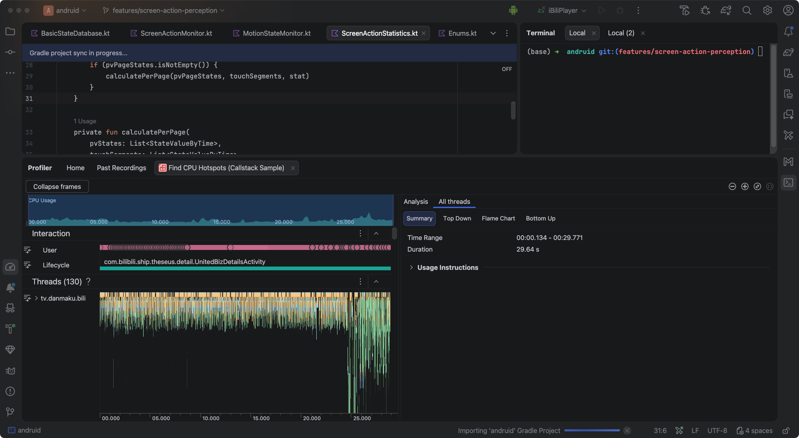

# 2026-06-01

两个问题：
1. 高层信息计算放在哪一块？
2. 最近 20 条的限制如何设计？
3. 坐标信息如何处理？可能需要新开一个数据结构

其实问题 1 和问题 2 本质上是一个问题，这边一定会有一步只需要最近 20 次的信息。而从数据存储地来看：目前数据会滞留在一块共享的 buffer 中，以及定期刷到移动设备的 DB 中，最后会有一个定期聚合上报。

针对最近 20 条限制的思考，针对上面数据的流向，可以做出如下的 20 条的限制：
- 如果在内存阶段，新开辟一个容量为 20 的 buffer 专门存储这些信息，其可以保证的就是每次从内存中读取的时候都可以读到最近 20 次的屏幕操作，那么对应
- 如果在数据库阶段，对20次做限制，相当于数据库中仅仅有 20 条，屏幕感知的数据。好处是，不再需要对数据库进行索引
- 如果在上报阶段，那么相当于不修改任何前沿过程，仅仅按照时间戳提取最近 20 次信息，那么算法的对象也就是针对数据库中的数据。

总结一下，本质上 20 条限制在哪里取决于高层特征信息的计算要求，如果想要实时计算特征，而在数据库中存储的是处理好的信息，那么应当在内存上进行限制；如果想要记录历史数据，那么不应该对内存进行任何限制，当需要上报的时候，直接从移动设备的 DB 数据库中检索最近 20 条信息进行计算，本地不存储任何高层特征信息，计算后直接上报到远端。

# 2026-06-02

根据上述描述，对屏幕触控手势行为分为如下两个级别：

| 行为级别   | 描述                        | 举例                                               |
| ------ | ------------------------- | ------------------------------------------------ |
| 低级手势行为 | 记录用户与屏幕的触控与否事件，无需判断，直接转发  | `TOUCH_DOWN / TOUCH_UP`                          |
| 高级手势行为 | 在原始事件之上识别具体手势类型，需要一定的判定窗口 | `TAP / DOUBLE_TAP / LONG_PRESS ...`              |
| 用户行为   | 在手势序列之上推断用户的交互习惯与意图       | `LEFT & RIGHT HAND / ATTENTION / ATTENTION AREA` |

根据数据流的三步走：`Buffer -> Room Database -> KNeuron`。如果在 Buffer 层做 20 条的限制，所有的行为推断都基于 Buffer 层内的 触控事件/手势类型产出，然后存储到 Room Database 中，后续流程就和其他监控流一致。

> [!note]
> 但是这样，就要在数据离开 monitor 后进行用户行为等识别，而用户行为等识别是需要坐标信息等，当前统一的 BasicStateEntity 是没有成员变量来存储坐标信息的，若要要存储坐标要么单独开辟一个数据结构，这样导致的后果是，后续的流程都要针对这个数据类型单独编写流程，代码量大。

不如？把针对手势的 buffer 直接放在 Monitor 内部，这样就可以获得原始的 ScreenActinData 类了，并且直接在Monitor内进行用户行为的提取，由于事件的播报都是时间刻的事件，因此将上述三种级别的行为进行如下定义：

| 行为级别   | 时间戳含义                    | 举例                                               |
| ------ | ------------------------ | ------------------------------------------------ |
| 低级手势行为 | 在这一时刻，该事件发生了，记录的是事件的开始区间 | `TOUCH_DOWN / TOUCH_UP`                          |
| 高级手势行为 | 在这一时刻，判定该事件发生了           | `TAP / DOUBLE_TAP / LONG_PRESS ...`              |
| 用户行为   | 在这一时刻，判定注意力在某个区域/判定惯用手为  | `LEFT & RIGHT HAND / ATTENTION / ATTENTION AREA` |

问题：
1. 极短时间内有无触摸，这个是 api 接口以何种形式提供
2. 坐标信息要不要上报，如果要上报那就需要修改 BasicStateEntity 的数据格式了 - 初步作为不上报处理
3. 触摸事件上报会不会太频繁了？

CPU 监测结果来看基本影响不大。

我想要重新设计一个ScreenActionMonitor 在 ScreenAction Monitor.kt 文件夹中，基于当前的版本：
- 当前版本中设计了一个 ScreenActionMonitor 承接 AndoridMain 中的信息，我想要先将从 Android 中的 ScreenActionData 放到一个 大小为 20 的缓冲 buffer 中，然后后续来的ScreenActionData都填入这个buffer 中，实现最近 20 条的实现，再之后根据 最近20 条的数据，做出某一短时间内有无触摸
- 该类中应当有两个主要的方式，一个往里面存数据，另一个外面消费数据
- 同时，对应的并发机制

# 2026-06-03

detectTouchPresence 函数先梳理其功能：基于 eventQueue 推断"参考时刻往回 windowMs 内是否有触摸活动"。
- 如果 eventQueue 中没有新的数据，就不检测，持续保持无触摸状态
- 如果 eventQueu 中有新数据进入，需要进行检测，输出短时是否触摸

实现方式：
- 用一个滑动的时间窗口，如果 eventQueue 中最晚的事件在时间窗口之外，那么就不进行检测
- 用一个滑动的时间窗口，如果 eventQueue 中最晚的事件在时间窗口之内，那么进行检测
- 注意，对于什么时候判断最晚事件是否在时间窗口之内也需要进行考虑

如何仅仅根据这 20 条数据判断是否有无触摸？
- 窗口外
- 窗口内

# 2026-06-04

如图为添加 ScreenActionMonitor 后的流程图。该模块的设计思路：原始的触摸事件像流水线一样仅仅进入大小为 20 的 eventQueue 中，专门的测试器 `detectors` 针对测试时刻下的 eventQueue ，进行对应的判断。

第一个阶段仅仅实现了 `TouchPresenceDetector` ，该测试器实现：短时内是否有触摸事件，具体来说其对测试时刻之前 500 ms 内是否有触摸事件进行输出。
- 若有触摸，输出字符串 `"TOUCH"`
- 若无触摸，输出字符串 `NO_TOUCH`

具体的实现逻辑如上图，涉及到相关配置为：检测间隔、队列容量、时间窗口、孤儿 DOWN 上限。
- 队列容量：提供检测器运行的最近事件的总数，固定为 20。
- 检测间隔：检测器检测频率，**允许通过远端下发**。
- 检测窗口：实现短时语意，检测器基于检测窗口内的时间进行短时是否有触摸的判断，**允许通过远端下发**。
- 队尾 Down 上限值：当判定是，队尾为 `TOUCH_DOWN` 事件时的兜底策略，固定为 5 mins。

>[!note]
>ticker 的检测周期必须不大于检测器的"短时"窗口，否则极短触摸会被完全漏掉。
>
>举个反例：如果检测间隔是 500 毫秒、检测窗口是 100 毫秒，用户做了一个持续 50 毫秒的快速 tap，DOWN 和 UP 全程在两次 tick 之间发生。等到 ticker 第一次醒来检测时，距 UP 已经过去 490 毫秒，远超 100 毫秒的窗口，检测器判为NO_TOUCH。整个过程中 touchPresenceFlow 从未出现过 TOUCH，触摸事件被悄无声息地吞掉。

**左侧：数据流 - 原始事件队列**

ScreenActionAnalyzer 内部维护一个最大长度 20 的事件队列，存储原始触摸事件。事件流入时从队尾入队，超出长度从队首出队，始终保持总数不超过 20。

当前事件类型仅有 TOUCH_DOWN 和 TOUCH_UP。ScreenAction 枚举已预留 TAP、DOUBLE_TAP、LONG_PRESS、FLING、SCROLL_HORIZONTAL、SCROLL_VERTICAL、PINCH_ZOOM 等高级手势，未来这些事件会同样进入队列。

**右侧：检测器 - `TouchPresenceDetector`**

检测器接收一个参考时刻，基于队尾事件加上参考时刻推断当前状态，产出 BasicStateEntity 或 null。当前唯一的检测器是 TouchPresenceDetector，回答"短时内是否有触摸"。未来可以并存 DominantHandDetector、VideoFocusDetector、AttentionAreaDetector 等。

判定规则按队尾事件分如下情况：
- 队列为空时返回 null，不产 entity。
- 队尾是 TOUCH_DOWN 时：
	- 如果距今不超过**队尾 Down 上限值**，则判为 TOUCH，
	- 如果距今超过**队尾 Down 上限值**，则判为 NO_TOUCH。
- 队尾是 TOUCH_UP 时，
	- 如果事件不超过**检测窗口**，则判为TOUCH
	- 如果事件超过**检测窗口**，则判为 NO_TOUCH。 

注意，为了避免在没有触摸事件期间，检测器仍然频繁检测，浪费 CPU 资源，设计了一个布尔`bufferActive` 节能开关。每次有触摸事件进入时写为 true，每次检测命中 NO_TOUCH 时写为 false。

ticker 协程在每次循环开始时通过 awaitActivation 等待 bufferActive 变为 true。bufferActive 为 false 时 ticker 整个挂起，零 CPU 占用。下一次触摸事件把 bufferActive 拉回 true，ticker 自动恢复。这样在无人触摸的长时间静默期不会有任何调度开销。

# 2026-06-11

关于获取 MotionEvent 的四种方案调研对比，确定还是走 window.callback 装勾子的方案。

# 2026-06-29

> [!note]
> **TODO：**
> - [x] 学习 STL 查询 AB 实验性能的流程
> - [x] 确定最终的 IOS 上实现 ScreenActionEvent 发送的方式
> 	- [x] 为何 UIGestureRecognizer 不可行？
> 	- [ ] 如果要自行实现 GestureRecognizer，选取那种架构实现比较好，参数如何确定？

为何 UIGestureRecognizer 不可行？
- kntr 仓库中的 ui 都是基于 compose UI 实现的，view上不挂载 UIGestureRecognizer。为了识别全局的触摸手势，必然在根 window 上挂载手势识别器，但是手势识别器对于触摸的优先级高于 view responder，因此会导致界面原有的交互逻辑失效。

现有的项目中，已经有自行实现 GestureRecognizer 的 iOS 手势监听项目，可以借鉴。

>[!question]
>后续是否可以在 commonMain 中直接实现双端的手势识别器，这样双端上的代码量会更小，所有的逻辑集中在 commonMain 中，阻塞的风险也会更小。

# 2026-06-30

> [!note]
> **TODO：**
> - [x] 如果要自行实现 GestureRecognizer，选取那种架构实现比较好，参数如何确定？

通过 swizzling 拉入原始的触摸事件，手写手势识别器，将 ScreenActionEvent 提供给上层。
- [x] 通过 ai coding，跑通 ios 端的手势识别

对于 Swizzle 值得深入学习