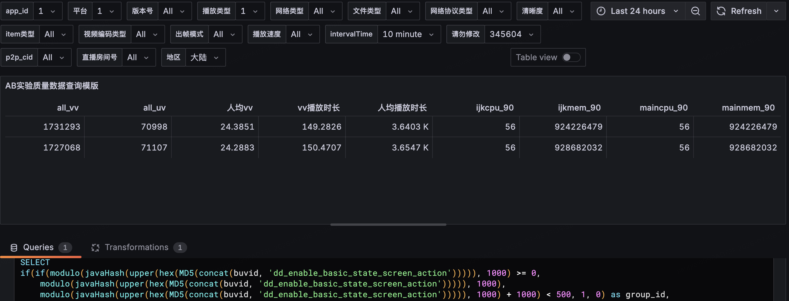

# 问题：稳态内存占用异常偏高

理论上该模块需要存储 "20 条 ring buffer" ，但是就算 20 条记录里每条 SCROLL 塞满 70 个 TouchPoint，也就占用 40KB，跟 4MB 差两个数量级。 

>[!note]
>这边有问题，版本号不应该是 All，这样会导致一些没有配置屏幕监听的播放事件对实验产生干扰，应当查找对应的发版日历进行确认。
## 使用 Xcode instruments 进行内存检查

时间轴还原如下：
- app启动埋点1  00:12  143.51 MiB / 38498。baseline (启动累积)
- app启动埋点2  00:24    84 KiB / 42。启动尾声，几乎无增长    
- 触摸开始前    00:30     0 / 0。完全静止 baseline OK   
- 触摸结束时    00:45  5.07 MiB / 747。15秒滑动，涨 5.07 MB
- app静止1      00:51   384 KiB / 6。6秒后回落到 384KB
- app静止2      00:57     0 / 0。12秒后完全归零  

## 线上 AB 实验查询版本检查

这里 iOS 端的版本是 90102100 对应的发行版本编号为 9.1.2，通过查询 kntr 仓库，如下：

改版本并没有在 iOS 端添加手势监听的数据流，但是内存增长却出现异常。

>[!note] 
>数据抖动

# 线上双端性能监测
## android 端
安卓端的代码自9.1.0发版以来，到9.3.0均含有手势监听到功能。
### 9.1.1

该版本的安卓端已经实现了复杂的手势监听功能。

**2026-07-04**

| 分组 | all_vv | all_uv | 人均vv | vv播放时长 | 人均播放时长 | ijkcpu_90 | ijkmem_90 | maincpu_90 | mainmem_90 |
| --- | --- | --- | --- | --- | --- | --- | --- | --- | --- |
| 对照组 | 1223741 | 29684 | 41.2256 | 111.0300 | 4.5773 K | 103 | 533061632 | 136 | 798745161 |
| 实验组 | 1251114 | 29822 | 41.9527 | 110.5500 | 4.6379 K | 103 | 526721024 | 135 | 807051264 |

**2026-07-05**

| 分组 | all_vv | all_uv | 人均vv | vv播放时长 | 人均播放时长 | ijkcpu_90 | ijkmem_90 | maincpu_90 | mainmem_90 |
| --- | --- | --- | --- | --- | --- | --- | --- | --- | --- |
| 对照组 | 2048204 | 48514 | 42.2188 | 122.4483 | 5.1696 K | 55 | 176844800 | 120 | 804595029 |
| 实验组 | 2084154 | 48621 | 42.8653 | 120.9414 | 5.1842 K | 55 | 177090560 | 120 | 804990976 |

**2026-07-06**

| 分组 | all_vv | all_uv | 人均vv | vv播放时长 | 人均播放时长 | ijkcpu_90 | ijkmem_90 | maincpu_90 | mainmem_90 |
| --- | --- | --- | --- | --- | --- | --- | --- | --- | --- |
| 对照组 | 2985074 | 70268 | 42.4813 | 122.2535 | 5.1935 K | 52 | 170975232 | 120 | 782176256 |
| 实验组 | 3037685 | 70384 | 43.1587 | 120.3283 | 5.1932 K | 51 | 171323392 | 121 | 785287850 |

**2026-07-07**

| 分组 | all_vv | all_uv | 人均vv | vv播放时长 | 人均播放时长 | ijkcpu_90 | ijkmem_90 | maincpu_90 | mainmem_90 |
| --- | --- | --- | --- | --- | --- | --- | --- | --- | --- |
| 对照组 | 3562562 | 81072 | 43.9432 | 123.8335 | 5.4416 K | 52 | 173707264 | 119 | 781201408 |
| 实验组 | 3634625 | 80813 | 44.9757 | 121.8981 | 5.4825 K | 52 | 174346240 | 120 | 786866995 |

**2026-07-08**

| 分组 | all_vv | all_uv | 人均vv | vv播放时长 | 人均播放时长 | ijkcpu_90 | ijkmem_90 | maincpu_90 | mainmem_90 |
| --- | --- | --- | --- | --- | --- | --- | --- | --- | --- |
| 对照组 | 3785925 | 85482 | 44.2891 | 124.0105 | 5.4923 K | 52 | 174180352 | 118 | 785301504 |
| 实验组 | 3863340 | 85001 | 45.4505 | 122.2173 | 5.5548 K | 52 | 174470290 | 119 | 796252569 |

**2026-07-09**

| 分组 | all_vv | all_uv | 人均vv | vv播放时长 | 人均播放时长 | ijkcpu_90 | ijkmem_90 | maincpu_90 | mainmem_90 |
| --- | --- | --- | --- | --- | --- | --- | --- | --- | --- |
| 对照组 | 3056219 | 70545 | 43.3230 | 125.5879 | 5.4408 K | 52 | 173801472 | 117 | 780693504 |
| 实验组 | 3090947 | 71276 | 43.3659 | 124.6686 | 5.4064 K | 52 | 174206976 | 117 | 781617444 |

**2026-07-10**

| 分组 | all_vv | all_uv | 人均vv | vv播放时长 | 人均播放时长 | ijkcpu_90 | ijkmem_90 | maincpu_90 | mainmem_90 |
| --- | --- | --- | --- | --- | --- | --- | --- | --- | --- |
| 对照组 | 2551932 | 59110 | 43.1726 | 125.3298 | 5.4108 K | 51 | 171823104 | 118 | 768684032 |
| 实验组 | 2629481 | 59794 | 43.9757 | 124.0109 | 5.4535 K | 50 | 171524096 | 119 | 771715072 |

**2026-07-11**

| 分组 | all_vv | all_uv | 人均vv | vv播放时长 | 人均播放时长 | ijkcpu_90 | ijkmem_90 | maincpu_90 | mainmem_90 |
| --- | --- | --- | --- | --- | --- | --- | --- | --- | --- |
| 对照组 | 1837836 | 44805 | 41.0185 | 130.1857 | 5.3400 K | 52 | 175337472 | 114 | 793321072 |
| 实验组 | 1859487 | 44778 | 41.5268 | 129.3123 | 5.3699 K | 52 | 175382528 | 116 | 797405184 |

**实验组 − 对照组 差值**

| 日期         | Δijkcpu_90 | Δijkmem_90         | Δmaincpu_90 | Δmainmem_90          |
| ---------- | ---------- | ------------------ | ----------- | -------------------- |
| 2026-07-04 | +0         | -6340608 (-6.05MB) | -1          | +8306103 (+7.92MB)   |
| 2026-07-05 | +0         | +245760 (+0.23MB)  | +0          | +395947 (+0.38MB)    |
| 2026-07-06 | -1         | +348160 (+0.33MB)  | +1          | +3111594 (+2.97MB)   |
| 2026-07-07 | +0         | +638976 (+0.61MB)  | +1          | +5665587 (+5.40MB)   |
| 2026-07-08 | +0         | +289938 (+0.28MB)  | +1          | +10951065 (+10.44MB) |
| 2026-07-09 | +0         | +405504 (+0.39MB)  | +0          | +923940 (+0.88MB)    |
| 2026-07-10 | -1         | -299008 (-0.29MB)  | +1          | +3031040 (+2.89MB)   |
| 2026-07-11 | +0         | +45056 (+0.04MB)   | +2          | +4084112 (+3.89MB)   |
| **均值**     | -0.25      | -583278 (-0.56MB)  | +0.62       | +4558674 (+4.35MB)   |

### 9.2.0

改版本与 9.1.1 相比并没有发生显著修改。

**2026-07-11**

| 分组 | all_vv | all_uv | 人均vv | vv播放时长 | 人均播放时长 | ijkcpu_90 | ijkmem_90 | maincpu_90 | mainmem_90 |
| --- | --- | --- | --- | --- | --- | --- | --- | --- | --- |
| 对照组 | 3009922 | 67836 | 44.3706 | 118.3449 | 5.2510 K | 54 | 170319872 | 119 | 674457600 |
| 实验组 | 3013693 | 67608 | 44.5760 | 118.6445 | 5.2887 K | 54 | 171036672 | 120 | 678182912 |

**2026-07-12**

| 分组  | all_vv  | all_uv | 人均vv    | vv播放时长   | 人均播放时长   | ijkcpu_90 | ijkmem_90 | maincpu_90 | mainmem_90 |
| --- | ------- | ------ | ------- | -------- | -------- | --------- | --------- | ---------- | ---------- |
| 对照组 | 3753347 | 82331  | 45.5885 | 121.9541 | 5.5597 K | 53        | 172232704 | 118        | 675098624  |
| 实验组 | 3797174 | 82256  | 46.1629 | 121.1808 | 5.5941 K | 53        | 172064768 | 119        | 678711296  |

**2026-07-13**

| 分组 | all_vv | all_uv | 人均vv | vv播放时长 | 人均播放时长 | ijkcpu_90 | ijkmem_90 | maincpu_90 | mainmem_90 |
| --- | --- | --- | --- | --- | --- | --- | --- | --- | --- |
| 对照组 | 4154609 | 90287 | 46.0156 | 122.3102 | 5.6282 K | 52 | 171749376 | 116 | 666083328 |
| 实验组 | 4207408 | 90226 | 46.6319 | 123.7687 | 5.7716 K | 52 | 172175360 | 117 | 669888512 |

**2026-07-14**

| 分组 | all_vv | all_uv | 人均vv | vv播放时长 | 人均播放时长 | ijkcpu_90 | ijkmem_90 | maincpu_90 | mainmem_90 |
| --- | --- | --- | --- | --- | --- | --- | --- | --- | --- |
| 对照组 | 4351401 | 96698 | 44.9999 | 124.7669 | 5.6145 K | 53 | 172965888 | 117 | 667828224 |
| 实验组 | 4451917 | 97014 | 45.8894 | 122.9762 | 5.6433 K | 53 | 173084672 | 117 | 667485184 |

**2026-07-15**

| 分组 | all_vv | all_uv | 人均vv | vv播放时长 | 人均播放时长 | ijkcpu_90 | ijkmem_90 | maincpu_90 | mainmem_90 |
| --- | --- | --- | --- | --- | --- | --- | --- | --- | --- |
| 对照组 | 4494953 | 100511 | 44.7210 | 123.3100 | 5.5145 K | 53 | 173907968 | 118 | 667840512 |
| 实验组 | 4576813 | 101000 | 45.3150 | 123.3998 | 5.5919 K | 53 | 174428160 | 119 | 670621696 |

**2026-07-16**

| 分组 | all_vv | all_uv | 人均vv | vv播放时长 | 人均播放时长 | ijkcpu_90 | ijkmem_90 | maincpu_90 | mainmem_90 |
| --- | --- | --- | --- | --- | --- | --- | --- | --- | --- |
| 对照组 | 3726242 | 86116 | 43.2700 | 125.1522 | 5.4153 K | 53 | 174952448 | 119 | 672178176 |
| 实验组 | 3816770 | 86472 | 44.1388 | 125.8423 | 5.5545 K | 53 | 174776320 | 119 | 673361920 |

**2026-07-17**

| 分组 | all_vv | all_uv | 人均vv | vv播放时长 | 人均播放时长 | ijkcpu_90 | ijkmem_90 | maincpu_90 | mainmem_90 |
| --- | --- | --- | --- | --- | --- | --- | --- | --- | --- |
| 对照组 | 3064262 | 71014 | 43.1501 | 126.7649 | 5.4699 K | 52 | 173710336 | 120 | 664227840 |
| 实验组 | 3142426 | 71389 | 44.0184 | 125.8747 | 5.5408 K | 51 | 172941312 | 119 | 668858140 |

**2026-07-18**

| 分组 | all_vv | all_uv | 人均vv | vv播放时长 | 人均播放时长 | ijkcpu_90 | ijkmem_90 | maincpu_90 | mainmem_90 |
| --- | --- | --- | --- | --- | --- | --- | --- | --- | --- |
| 对照组 | 2140000 | 52637 | 40.6558 | 131.3177 | 5.3388 K | 54 | 179490816 | 116 | 685506560 |
| 实验组 | 2160741 | 52687 | 41.0109 | 132.0720 | 5.4164 K | 54 | 178806784 | 115 | 685699072 |

**实验组 − 对照组 差值**

| 日期         | Δijkcpu_90 | Δijkmem_90        | Δmaincpu_90 | Δmainmem_90        |
| ---------- | ---------- | ----------------- | ----------- | ------------------ |
| 2026-07-11 | +0         | +716800 (+0.68MB) | +1          | +3725312 (+3.55MB) |
| 2026-07-12 | +0         | -167936 (-0.16MB) | +1          | +3612672 (+3.45MB) |
| 2026-07-13 | +0         | +425984 (+0.41MB) | +1          | +3805184 (+3.63MB) |
| 2026-07-14 | +0         | +118784 (+0.11MB) | +0          | -343040 (-0.33MB)  |
| 2026-07-15 | +0         | +520192 (+0.50MB) | +1          | +2781184 (+2.65MB) |
| 2026-07-16 | +0         | -176128 (-0.17MB) | +0          | +1183744 (+1.13MB) |
| 2026-07-17 | -1         | -769024 (-0.73MB) | -1          | +4630300 (+4.42MB) |
| 2026-07-18 | +0         | -684032 (-0.65MB) | -1          | +192512 (+0.18MB)  |
| **均值**     | -0.12      | -1920 (-0.00MB)   | +0.25       | +2448484 (+2.34MB) |

### 9.3.0

改版本与 9.1.1 相比并没有发生显著修改。

**2026-07-17**

| 分组 | all_vv | all_uv | 人均vv | vv播放时长 | 人均播放时长 | ijkcpu_90 | ijkmem_90 | maincpu_90 | mainmem_90 |
| --- | --- | --- | --- | --- | --- | --- | --- | --- | --- |
| 对照组 | 1827490 | 43383 | 42.1246 | 115.8609 | 4.8806 K | 123 | 589873152 | 138 | 699359232 |
| 实验组 | 1866336 | 43118 | 43.2844 | 114.4667 | 4.9546 K | 123 | 592687104 | 138 | 700510208 |

**2026-07-18**

| 分组 | all_vv | all_uv | 人均vv | vv播放时长 | 人均播放时长 | ijkcpu_90 | ijkmem_90 | maincpu_90 | mainmem_90 |
| --- | --- | --- | --- | --- | --- | --- | --- | --- | --- |
| 对照组 | 3071143 | 73241 | 41.9320 | 121.6726 | 5.1020 K | 129 | 607580160 | 142 | 689209344 |
| 实验组 | 3146731 | 73111 | 43.0405 | 119.8542 | 5.1586 K | 129 | 609252693 | 142 | 695047509 |

**2026-07-19**

| 分组 | all_vv | all_uv | 人均vv | vv播放时长 | 人均播放时长 | ijkcpu_90 | ijkmem_90 | maincpu_90 | mainmem_90 |
| --- | --- | --- | --- | --- | --- | --- | --- | --- | --- |
| 对照组 | 3853200 | 87505 | 44.0341 | 125.2050 | 5.5133 K | 128 | 610562048 | 139 | 689528832 |
| 实验组 | 3902550 | 87530 | 44.5853 | 124.1012 | 5.5331 K | 128 | 605319168 | 139 | 691433472 |

**2026-07-20**

| 分组 | all_vv | all_uv | 人均vv | vv播放时长 | 人均播放时长 | ijkcpu_90 | ijkmem_90 | maincpu_90 | mainmem_90 |
| --- | --- | --- | --- | --- | --- | --- | --- | --- | --- |
| 对照组 | 4236697 | 95895 | 44.1806 | 123.5332 | 5.4578 K | 128 | 609349632 | 140 | 688721920 |
| 实验组 | 4362546 | 96309 | 45.2974 | 121.5677 | 5.5067 K | 128 | 607940608 | 140 | 691507200 |

**2026-07-21**

| 分组 | all_vv | all_uv | 人均vv | vv播放时长 | 人均播放时长 | ijkcpu_90 | ijkmem_90 | maincpu_90 | mainmem_90 |
| --- | --- | --- | --- | --- | --- | --- | --- | --- | --- |
| 对照组 | 4483857 | 102380 | 43.7962 | 124.9128 | 5.4707 K | 128 | 607211520 | 139 | 687460352 |
| 实验组 | 4597685 | 102187 | 44.9929 | 123.7689 | 5.5687 K | 128 | 607334400 | 139 | 689198460 |

**实验组 − 对照组 差值**

| 日期         | Δijkcpu_90 | Δijkmem_90         | Δmaincpu_90 | Δmainmem_90        |
| ---------- | ---------- | ------------------ | ----------- | ------------------ |
| 2026-07-17 | +0         | +2813952 (+2.68MB) | +0          | +1150976 (+1.10MB) |
| 2026-07-18 | +0         | +1672533 (+1.60MB) | +0          | +5838165 (+5.57MB) |
| 2026-07-19 | +0         | -5242880 (-5.00MB) | +0          | +1904640 (+1.82MB) |
| 2026-07-20 | +0         | -1409024 (-1.34MB) | +0          | +2785280 (+2.66MB) |
| 2026-07-21 | +0         | +122880 (+0.12MB)  | +0          | +1738108 (+1.66MB) |
| **均值**     | +0.00      | -408508 (-0.39MB)  | +0.00       | +2683434 (+2.56MB) |

## iOS 端
iOS 端端代码只有在 9.2.0 和 9.3.0 这两个版本中留存；但是由于存在严重的数据抖动问题，对 9.1.0 和 9.0.0 的版本性能也进行简单观察一下。

### 9.0.0

**2026-06-28**

| 分组 | all_vv | all_uv | 人均vv | vv播放时长 | 人均播放时长 | ijkcpu_90 | ijkmem_90 | maincpu_90 | mainmem_90 |
| --- | --- | --- | --- | --- | --- | --- | --- | --- | --- |
| 对照组 | 1085230 | 45045 | 24.0921 | 143.1243 | 3.4482 K | 55 | 870222904 | 55 | 870222904 |
| 实验组 | 1095325 | 44939 | 24.3736 | 141.4704 | 3.4481 K | 55 | 874648880 | 55 | 874648880 |

**2026-06-29**

| 分组 | all_vv | all_uv | 人均vv | vv播放时长 | 人均播放时长 | ijkcpu_90 | ijkmem_90 | maincpu_90 | mainmem_90 |
| --- | --- | --- | --- | --- | --- | --- | --- | --- | --- |
| 对照组 | 1220862 | 49383 | 24.7223 | 151.5476 | 3.7466 K | 55 | 876134480 | 55 | 876134480 |
| 实验组 | 1210847 | 49562 | 24.4310 | 152.6660 | 3.7298 K | 55 | 872120065 | 55 | 872120065 |

**2026-06-30**

| 分组 | all_vv | all_uv | 人均vv | vv播放时长 | 人均播放时长 | ijkcpu_90 | ijkmem_90 | maincpu_90 | mainmem_90 |
| --- | --- | --- | --- | --- | --- | --- | --- | --- | --- |
| 对照组 | 1253926 | 50562 | 24.7998 | 148.7129 | 3.6880 K | 55 | 874777440 | 55 | 874777440 |
| 实验组 | 1267128 | 50743 | 24.9715 | 146.7842 | 3.6654 K | 55 | 867482816 | 55 | 867482816 |

**2026-07-01**

| 分组 | all_vv | all_uv | 人均vv | vv播放时长 | 人均播放时长 | ijkcpu_90 | ijkmem_90 | maincpu_90 | mainmem_90 |
| --- | --- | --- | --- | --- | --- | --- | --- | --- | --- |
| 对照组 | 1217369 | 49998 | 24.3484 | 151.1019 | 3.6791 K | 55 | 877662411 | 55 | 877662411 |
| 实验组 | 1235858 | 50210 | 24.6138 | 151.0552 | 3.7180 K | 55 | 878636232 | 55 | 878636232 |

**2026-07-02**

| 分组 | all_vv | all_uv | 人均vv | vv播放时长 | 人均播放时长 | ijkcpu_90 | ijkmem_90 | maincpu_90 | mainmem_90 |
| --- | --- | --- | --- | --- | --- | --- | --- | --- | --- |
| 对照组 | 1218060 | 49267 | 24.7236 | 149.5270 | 3.6969 K | 55 | 895634024 | 55 | 895634024 |
| 实验组 | 1225030 | 49413 | 24.7917 | 148.8932 | 3.6913 K | 55 | 893555336 | 55 | 893555336 |

**2026-07-03**

| 分组 | all_vv | all_uv | 人均vv | vv播放时长 | 人均播放时长 | ijkcpu_90 | ijkmem_90 | maincpu_90 | mainmem_90 |
| --- | --- | --- | --- | --- | --- | --- | --- | --- | --- |
| 对照组 | 790646 | 36392 | 21.7258 | 152.7824 | 3.3193 K | 56 | 907987952 | 56 | 907987952 |
| 实验组 | 820312 | 36698 | 22.3530 | 147.2259 | 3.2909 K | 55 | 901467023 | 55 | 901467023 |

**实验组 − 对照组 差值**

| 日期         | Δijkcpu_90 | Δijkmem_90         | Δmaincpu_90 | Δmainmem_90        |
| ---------- | ---------- | ------------------ | ----------- | ------------------ |
| 2026-06-28 | +0         | +4425976 (+4.22MB) | +0          | +4425976 (+4.22MB) |
| 2026-06-29 | +0         | -4014415 (-3.83MB) | +0          | -4014415 (-3.83MB) |
| 2026-06-30 | +0         | -7294624 (-6.96MB) | +0          | -7294624 (-6.96MB) |
| 2026-07-01 | +0         | +973821 (+0.93MB)  | +0          | +973821 (+0.93MB)  |
| 2026-07-02 | +0         | -2078688 (-1.98MB) | +0          | -2078688 (-1.98MB) |
| 2026-07-03 | -1         | -6520929 (-6.22MB) | -1          | -6520929 (-6.22MB) |
| **均值**     | -0.17      | -2418143 (-2.31MB) | -0.17       | -2418143 (-2.31MB) |

### 9.1.2

**2026-07-07**

| 分组 | all_vv | all_uv | 人均vv | vv播放时长 | 人均播放时长 | ijkcpu_90 | ijkmem_90 | maincpu_90 | mainmem_90 |
| --- | --- | --- | --- | --- | --- | --- | --- | --- | --- |
| 对照组 | 544424 | 25315 | 21.5060 | 131.9979 | 2.8387 K | 58 | 900478661 | 58 | 900478661 |
| 实验组 | 533250 | 25462 | 20.9430 | 134.6977 | 2.8210 K | 58 | 897682439 | 58 | 897682439 |

**2026-07-08**

| 分组 | all_vv | all_uv | 人均vv | vv播放时长 | 人均播放时长 | ijkcpu_90 | ijkmem_90 | maincpu_90 | mainmem_90 |
| --- | --- | --- | --- | --- | --- | --- | --- | --- | --- |
| 对照组 | 992728 | 42358 | 23.4366 | 143.4967 | 3.3631 K | 57 | 936021240 | 57 | 936021240 |
| 实验组 | 996573 | 42477 | 23.4615 | 141.5378 | 3.3207 K | 58 | 941918848 | 58 | 941918848 |

**2026-07-09**

| 分组 | all_vv | all_uv | 人均vv | vv播放时长 | 人均播放时长 | ijkcpu_90 | ijkmem_90 | maincpu_90 | mainmem_90 |
| --- | --- | --- | --- | --- | --- | --- | --- | --- | --- |
| 对照组 | 1154435 | 46356 | 24.9037 | 144.3303 | 3.5944 K | 57 | 962473111 | 57 | 962473111 |
| 实验组 | 1154304 | 46659 | 24.7392 | 144.3381 | 3.5708 K | 57 | 970931224 | 57 | 970931224 |

**2026-07-10**

| 分组 | all_vv | all_uv | 人均vv | vv播放时长 | 人均播放时长 | ijkcpu_90 | ijkmem_90 | maincpu_90 | mainmem_90 |
| --- | --- | --- | --- | --- | --- | --- | --- | --- | --- |
| 对照组 | 1147968 | 46444 | 24.7173 | 144.2583 | 3.5657 K | 57 | 969597706 | 57 | 969597706 |
| 实验组 | 1160734 | 46825 | 24.7888 | 143.3590 | 3.5537 K | 58 | 978258904 | 58 | 978258904 |

**2026-07-11**

| 分组 | all_vv | all_uv | 人均vv | vv播放时长 | 人均播放时长 | ijkcpu_90 | ijkmem_90 | maincpu_90 | mainmem_90 |
| --- | --- | --- | --- | --- | --- | --- | --- | --- | --- |
| 对照组 | 1024839 | 42756 | 23.9695 | 144.0426 | 3.4526 K | 58 | 979935977 | 58 | 979935977 |
| 实验组 | 1057247 | 42708 | 24.7552 | 141.4109 | 3.5007 K | 57 | 993432920 | 57 | 993432920 |

**2026-07-12**

| 分组 | all_vv | all_uv | 人均vv | vv播放时长 | 人均播放时长 | ijkcpu_90 | ijkmem_90 | maincpu_90 | mainmem_90 |
| --- | --- | --- | --- | --- | --- | --- | --- | --- | --- |
| 对照组 | 457411 | 21989 | 20.8018 | 148.7481 | 3.0942 K | 56 | 1013648416 | 56 | 1013648416 |
| 实验组 | 470835 | 22178 | 21.2298 | 147.1197 | 3.1233 K | 56 | 1021316344 | 56 | 1021316344 |

**实验组 − 对照组 差值**

| 日期         | Δijkcpu_90 | Δijkmem_90           | Δmaincpu_90 | Δmainmem_90          |
| ---------- | ---------- | -------------------- | ----------- | -------------------- |
| 2026-07-07 | +0         | -2796222 (-2.67MB)   | +0          | -2796222 (-2.67MB)   |
| 2026-07-08 | +1         | +5897608 (+5.62MB)   | +1          | +5897608 (+5.62MB)   |
| 2026-07-09 | +0         | +8458113 (+8.07MB)   | +0          | +8458113 (+8.07MB)   |
| 2026-07-10 | +1         | +8661198 (+8.26MB)   | +1          | +8661198 (+8.26MB)   |
| 2026-07-11 | -1         | +13496943 (+12.87MB) | -1          | +13496943 (+12.87MB) |
| 2026-07-12 | +0         | +7667928 (+7.31MB)   | +0          | +7667928 (+7.31MB)   |
| **均值**     | +0.17      | +6897595 (+6.58MB)   | +0.17       | +6897595 (+6.58MB)   |

### 9.2.0

**2026-07-12**

| 分组 | all_vv | all_uv | 人均vv | vv播放时长 | 人均播放时长 | ijkcpu_90 | ijkmem_90 | maincpu_90 | mainmem_90 |
| --- | --- | --- | --- | --- | --- | --- | --- | --- | --- |
| 对照组 | 993327 | 44210 | 22.4684 | 134.0275 | 3.0114 K | 56 | 929194639 | 56 | 929194639 |
| 实验组 | 989905 | 44394 | 22.2982 | 135.0142 | 3.0106 K | 56 | 925104576 | 56 | 925104576 |

**2026-07-13**

| 分组 | all_vv | all_uv | 人均vv | vv播放时长 | 人均播放时长 | ijkcpu_90 | ijkmem_90 | maincpu_90 | mainmem_90 |
| --- | --- | --- | --- | --- | --- | --- | --- | --- | --- |
| 对照组 | 1306041 | 51758 | 25.2336 | 144.2228 | 3.6393 K | 56 | 935133063 | 56 | 935133063 |
| 实验组 | 1305080 | 51888 | 25.1519 | 145.0439 | 3.6481 K | 56 | 937790280 | 56 | 937790280 |

**2026-07-14**

| 分组 | all_vv | all_uv | 人均vv | vv播放时长 | 人均播放时长 | ijkcpu_90 | ijkmem_90 | maincpu_90 | mainmem_90 |
| --- | --- | --- | --- | --- | --- | --- | --- | --- | --- |
| 对照组 | 1317799 | 52707 | 25.0024 | 145.4895 | 3.6376 K | 57 | 940859705 | 57 | 940859705 |
| 实验组 | 1328040 | 52920 | 25.0952 | 145.7133 | 3.6567 K | 57 | 950883632 | 57 | 950883632 |

**2026-07-15**

| 分组 | all_vv | all_uv | 人均vv | vv播放时长 | 人均播放时长 | ijkcpu_90 | ijkmem_90 | maincpu_90 | mainmem_90 |
| --- | --- | --- | --- | --- | --- | --- | --- | --- | --- |
| 对照组 | 1269467 | 51743 | 24.5341 | 145.5223 | 3.5703 K | 57 | 927885736 | 57 | 927885736 |
| 实验组 | 1308882 | 51785 | 25.2753 | 143.6390 | 3.6305 K | 56 | 937834636 | 56 | 937834636 |

**2026-07-16**

| 分组 | all_vv | all_uv | 人均vv | vv播放时长 | 人均播放时长 | ijkcpu_90 | ijkmem_90 | maincpu_90 | mainmem_90 |
| --- | --- | --- | --- | --- | --- | --- | --- | --- | --- |
| 对照组 | 1272518 | 51642 | 24.6411 | 143.8647 | 3.5450 K | 57 | 943049688 | 57 | 943049688 |
| 实验组 | 1306067 | 51839 | 25.1947 | 142.1890 | 3.5824 K | 57 | 948472888 | 57 | 948472888 |

**2026-07-17**

| 分组 | all_vv | all_uv | 人均vv | vv播放时长 | 人均播放时长 | ijkcpu_90 | ijkmem_90 | maincpu_90 | mainmem_90 |
| --- | --- | --- | --- | --- | --- | --- | --- | --- | --- |
| 对照组 | 1236037 | 50122 | 24.6606 | 143.4462 | 3.5375 K | 56 | 940559312 | 56 | 940559312 |
| 实验组 | 1267023 | 50497 | 25.0911 | 141.7982 | 3.5579 K | 56 | 950065792 | 56 | 950065792 |

**2026-07-18**

| 分组 | all_vv | all_uv | 人均vv | vv播放时长 | 人均播放时长 | ijkcpu_90 | ijkmem_90 | maincpu_90 | mainmem_90 |
| --- | --- | --- | --- | --- | --- | --- | --- | --- | --- |
| 对照组 | 1258055 | 50715 | 24.8064 | 147.5241 | 3.6595 K | 56 | 951651192 | 56 | 951651192 |
| 实验组 | 1281661 | 51072 | 25.0952 | 144.1275 | 3.6169 K | 56 | 956599808 | 56 | 956599808 |

**2026-07-19**

| 分组 | all_vv | all_uv | 人均vv | vv播放时长 | 人均播放时长 | ijkcpu_90 | ijkmem_90 | maincpu_90 | mainmem_90 |
| --- | --- | --- | --- | --- | --- | --- | --- | --- | --- |
| 对照组 | 1008970 | 41913 | 24.0730 | 148.5404 | 3.5758 K | 55 | 956030144 | 55 | 956030144 |
| 实验组 | 1039791 | 42432 | 24.5049 | 145.3969 | 3.5629 K | 55 | 967511204 | 55 | 967511204 |

**实验组 − 对照组 差值**

| 日期         | Δijkcpu_90 | Δijkmem_90           | Δmaincpu_90 | Δmainmem_90          |
| ---------- | ---------- | -------------------- | ----------- | -------------------- |
| 2026-07-12 | +0         | -4090063 (-3.90MB)   | +0          | -4090063 (-3.90MB)   |
| 2026-07-13 | +0         | +2657217 (+2.53MB)   | +0          | +2657217 (+2.53MB)   |
| 2026-07-14 | +0         | +10023927 (+9.56MB)  | +0          | +10023927 (+9.56MB)  |
| 2026-07-15 | -1         | +9948900 (+9.49MB)   | -1          | +9948900 (+9.49MB)   |
| 2026-07-16 | +0         | +5423200 (+5.17MB)   | +0          | +5423200 (+5.17MB)   |
| 2026-07-17 | +0         | +9506480 (+9.07MB)   | +0          | +9506480 (+9.07MB)   |
| 2026-07-18 | +0         | +4948616 (+4.72MB)   | +0          | +4948616 (+4.72MB)   |
| 2026-07-19 | +0         | +11481060 (+10.95MB) | +0          | +11481060 (+10.95MB) |
| **均值**     | -0.12      | +6237417 (+5.95MB)   | -0.12       | +6237417 (+5.95MB)   |

### 9.3.0

版本号为 90300100

**2026-07-20**

| 分组 | all_vv | all_uv | 人均vv | vv播放时长 | 人均播放时长 | ijkcpu_90 | ijkmem_90 | maincpu_90 | mainmem_90 |
| --- | --- | --- | --- | --- | --- | --- | --- | --- | --- |
| 对照组 | 1000975 | 44553 | 22.4671 | 144.6832 | 3.2506 K | 55 | 895798184 | 55 | 895798184 |
| 实验组 | 1011861 | 44348 | 22.8164 | 143.1770 | 3.2668 K | 54 | 905235144 | 54 | 905235144 |

**2026-07-21**

| 分组  | all_vv  | all_uv | 人均vv    | vv播放时长   | 人均播放时长   | ijkcpu_90 | ijkmem_90 | maincpu_90 | mainmem_90 |
| --- | ------- | ------ | ------- | -------- | -------- | --------- | --------- | ---------- | ---------- |
| 对照组 | 1250377 | 51405  | 24.3240 | 154.5310 | 3.7588 K | 54        | 922913920 | 54         | 922913920  |
| 实验组 | 1282773 | 51435  | 24.9397 | 152.5692 | 3.8050 K | 54        | 925111408 | 54         | 925111408  |

**2026-07-22**

| 分组  | all_vv  | all_uv | 人均vv    | vv播放时长   | 人均播放时长   | ijkcpu_90 | ijkmem_90 | maincpu_90 | mainmem_90 |
| --- | ------- | ------ | ------- | -------- | -------- | --------- | --------- | ---------- | ---------- |
| 对照组 | 1275919 | 50874  | 25.0800 | 153.0399 | 3.8382 K | 55        | 922334164 | 55         | 922334164  |
| 实验组 | 1295449 | 51275  | 25.2647 | 150.9060 | 3.8126 K | 54        | 915155640 | 54         | 915155640  |

**实验组 − 对照组 差值**

| 日期         | Δijkcpu_90 | Δijkmem_90       | Δmaincpu_90 | Δmainmem_90      |
| ---------- | ---------- | ---------------- | ----------- | ---------------- |
| 2026-07-20 | -1 | +9436960 (+9.00MB) | -1 | +9436960 (+9.00MB) |
| 2026-07-21 | +0 | +2197488 (+2.10MB) | +0 | +2197488 (+2.10MB) |
| **均值** | -0.50 | +5817224 (+5.55MB) | -0.50 | +5817224 (+5.55MB) |

### 9.4.0

