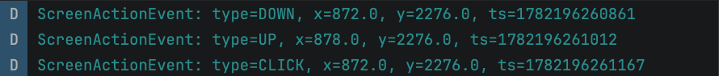
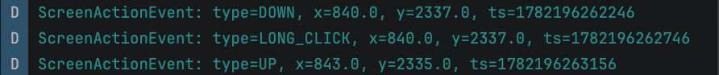
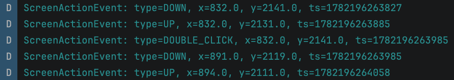
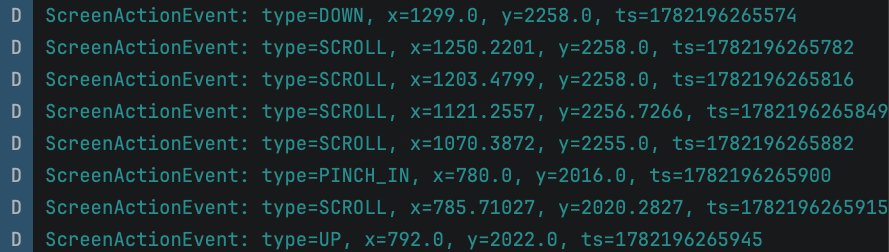
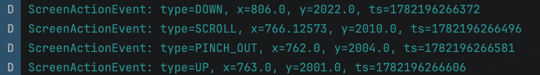
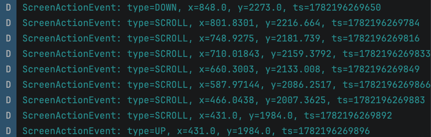

# 快速开始


# 整体框架

上图背景为 basic-state 模块原有的数据流示意图，在此基础上新增 ScreenActionMonitor 子模块，用于感知用户的屏幕交互状态。整体数据链路如下：

入库流程：
1. **原始数据获取**：用户按压屏幕，Android 拿到 MotionEvent，iOS 拿到 UIEvent
	1. Android 代理 Window.Callback.dispatchTouchEvent
    2. iOS swizzle UIApplication.sendEvent
2. **数据类型统一**：双端各自识别出手势类型，封装成统一的手势信号 ScreenActionSignal`
3. **轨迹信息提取**：信号流入ScreenActionMonitor，由内部的 ScreenActionAnalyzer  将信号组装成一次完整记录 ScreenActionRecord；并同步产出以下信息（统一为 BasicStateEntity）。
    1. 有无屏幕内触摸
    2. 视频观看专注度【待实现】
    3. 用户注意力区域【待实现】
4. **行为记录入队**：每产出一条 `ScreenActionRecord` ，同步送入一容量为 20 的环形队列中，对外暴露快照查询接口，供崩溃现场回放。
5. **统一入库广播**：产出的 BasicStateEntity 和其他的流 merge 成同一条流，进入 StateCollector 的入 库逻辑；同时，同步经 BasicStateBroadcast 广播给订阅者。

拟实现的手势识别类型为：单击、双击、长按、滑动、缩小、放大。

# 数据类型

本模块拟使用的数据结构如下：

```kotlin
internal data class TouchPoint(                                                  
      val x: Float,           // 归一化 [0, 1]
      val y: Float,           // 归一化 [0, 1]              
      val timestamp: Long,    // 墙钟毫秒
) // 单个触摸采样点(commonMain)
```

```kotlin
internal data class ScreenActionSignal( 
	val type: GestureSignal, 
	val timestamp: Long, 
	val point: TouchPoint, 
	val windowW: Float, 
	val windowH: Float, 
) // Event 传进一个时刻事件，因此只需要记录一个 point 即可
```

```kotlin
internal data class ScreenActionRecord( 
	val type: ScreenActionType, 
	val startTimestamp: Long, 
	val endTimestamp: Long, 
	val windowW: Float, 
	val windowH: Float, 
	val hand: DominantHand = DominantHand.UNKNOWN, 
	val path: List<TouchPoint> = emptyList(), 
) // Record 记录一个时段事件，集成了多个 Event 的信息
```

```kotlin
internal data class RawTouchSnapshot(                                            
      val pointerId: Long,      // UITouch 实例 hash,跨帧追踪同指
      val phase: TouchPhase,    // BEGAN / MOVED / ENDED / CANCELLED
      val px: Float,            // window 内绝对 pt
      val py: Float, 
      val windowW: Float,       // 归一化用
      val windowH: Float,
      val tsMs: Long,           // 整帧统一墙钟毫秒
) // iOS 整帧单点触摸快照,swizzle callback → detector 的载体(iosMain)
```

上报的数据走 BasicStateEntity 协议，存储形式如下：

```kotlin 
return createStateEntity( 
	field = StateField.SCREEN_TOUCH_PRESENCE, 
	value = presence.name, 
	timestamp = data.timestamp, 
)// 返回时原地构造一个 BasicStateEntity
  
data class TouchPresenceState(
	val presence: TouchPresence,   // UNKNOWN / TOUCH / NO_TOUCH
	val timestamp: Long,           // 边沿翻转时刻                               
)// 对外广播的触摸存在状态,StateFlow 元素类型(commonMain, public)   
```

```kotlin
return createStateEntity(
	field = StateField.SCREEN_ACTION_TYPE, // CLICK, DOUBLE_CLICK, ..
	value = string, // 采用 json 字段填值 {t,x,y,d,h,hp,wh,ww} 
	timestamp = data.timestamp, 
)// 返回时原地构造一个 BasicStateEntity
   
data class ScreenActionEvent(                                                    
      val timestamp: Long,                                                       
      val payload: String,   // JSON: {t,x,y,d,h,hp,wh,ww} 
)// 对外广播的手势会话事件,SharedFlow 元素类型(commonMain, public) 
```

# 数据收集链路

## 原始数据获取
双端都是"被动观察"：不参与 UI 事件分发/手势仲裁，只旁路拷贝一份原始事件用于识别，业务侧无感。总开关 DeviceDecision.dd_enable_basic_state_screen_action，关闭时直接返回emptyFlow()。
### android


安卓端设计挂载点，当 Application.ActivityLifecycleCallbacks.onActivityResumed 时，对当前 Activity 的 window.callback 做一次代理包装。callback 用 Kotlin 委托保留原实现，只重写 dispatchTouchEvent，把 MotionEvent 送进 GestureClassifier 后立刻返回原逻辑。
  
补漏：注册 ActivityLifecycleCallbacks 后，onResume 已过的顶层 Activity 不会再回调，通过反射 ActivityThread.mActivities 找到当前非 paused 的 Activity 主动补挂一次（findTopActivity）。

对于手势的识别，手势语义交给系统提供的手势 api，事件边界（DOWN/UP/CANCEL）自己读 actionMasked 兜底。GestureClassifier 采用安卓原生的 api 接口：

| 手势分类器                    | 类型     | 产出信号         | 触发时机 / 判定条件                                             |
| ------------------------ | ------ | ------------ | ------------------------------------------------------- |
| GestureDetector          | 单指     | CLICK        | onSingleTapConfirmed — 抬起后超过双击时窗仍未再按下，确认为单击             |
| GestureDetector          | 单指     | DOUBLE_CLICK | onDoubleTap — 两次抬起间隔在系统双击窗口内且位置接近                       |
| GestureDetector          | 单指     | LONG_CLICK   | onLongPress — 按下超过系统长按超时（默认 500ms）且未移动                  |
| GestureDetector          | 单指     | SCROLL       | onScroll — 拖动位移超过系统 touchSlop；再按 1% 屏宽归一化距离节流二次限流       |
| ScaleGestureDetector     | 双指     | PINCH_IN     | onScaleEnd — currentSpan < previousSpan（两指靠拢）           |
| ScaleGestureDetector     | 双指     | PINCH_OUT    | onScaleEnd — currentSpan > previousSpan（两指张开）           |
| MotionEvent.actionMasked | 原始事件   | DOWN         | ACTION_DOWN — 手指首次按下（当前代码走 GestureDetector.onDown，语义等价） |
| MotionEvent.actionMasked | 原始事件兜底 | UP           | ACTION_UP — 最后一根手指抬起                                    |
| MotionEvent.actionMasked | 原始事件兜底 | CANCEL       | ACTION_CANCEL — 事件序列被系统/父 View 打断（上层 Analyzer 映射为 BACK） |

### iOS

iOS 没有系统级的 GestureDetector 可用（UIGestureRecognizer 会参与手势仲裁，出现卡 UI 的情况。因此选择自建手势和状态机识别，阈值对齐 Android，保证双端一致：
```
UIApplication.sendEvent:  ← swizzle 拦截
          │
          └─ collectTouches(event) 拷出整帧                    
  List<RawTouchSnapshot>                                       
                  │                                            
                  ├─ MultiFingerDetector.feedFrame
                  └─ SingleFingerDetector.feedFrame

```

```kotlin
internal data class RawTouchSnapshot(                        
      val pointerId: Long,   // 跨帧追踪同一根手指             
      val phase: TouchPhase, // BEGAN / MOVED / ENDED / CANCELLED
      val px: Float,         // window 内绝对 pt 坐标          
      val py: Float,                                           
      val windowW: Float,    // 所属 window 尺寸 (pt)          
      val windowH: Float,                                      
      val tsMs: Long,        // 整帧统一墙钟毫秒               
  ) 
```

RawTouchSnapshot 是从 UIKit 到 Kotlin 状态机的"边界层"，让 detector 状态机跑在纯值语义里，不受 UITouch 复用/GC/多 Scene 影响。
## 数据类型统一

从双端送入的手势信号（ScreenActionSignal）基于实际手势的不同，遵循如下流模式：

单击：


长按：


双击：


缩小：


放大：


滑动：


因此，可以在 GestureSignal 流与 BasicStateEntity 落库之间架一层 ScreenActionAnalyzer：手势信号先进入内部 SessionBuffer 累积成一次触摸会话，遇到终态事件（CLICK / DOUBLE_CLICK / LONG_CLICK / PINCH / CANCEL，以及带 SCROLL 的 UP）时统一 commit，将同一会话内的多个原子信号合并、聚类为一条语义完整的 ScreenActionRecord——携带类型、起止时间戳、窗口尺寸、完整轨迹与主用手推断，作为对外稳定的最小语义单元向下游输出。
## 轨迹信息提取
### 有无屏幕内触摸


### 操作手识别算法

相关参考资料如下：
- 论文 1 标题：Implicit detection of user handedness in touchscreen devices through interaction analysis
	- 链接：[https://peerj.com/articles/cs-487.pdf](https://peerj.com/articles/cs-487.pdf)
- 论文 2 标题：Recognizing the Operating Hand and the Hand-Changing Process for User Interface Adjustment on Smartphones
	- 链接：[https://www.mdpi.com/1424-8220/16/8/1314](https://www.mdpi.com/1424-8220/16/8/1314)
- 论文 3 标题：Hand-and-finger-awareness for mobile touch Interaction using deep learning
	- 链接：[https://elib.uni-stuttgart.de/items/f7cb9e75-8168-4760-8964-07a8073fb020](https://elib.uni-stuttgart.de/items/f7cb9e75-8168-4760-8964-07a8073fb020)

最终，选择论文 2 中的随机森林算法部署到移动端上，实现端智能的操作手判断功能，以下为相关枚举类的定义：

```kotlin
internal enum class DominantHand {
    LEFT, // 左手
    RIGHT, // 右手
    UNKNOWN, // 未知
    ;
} // 用于左右手的枚举类定义
```

由于用户有横屏播放视频的需求，而横竖屏手势分布差异较大，共用一套算法会降低精度，因此分别训练了两套模型：

```kotlin
internal enum class Orientation {
    PORTRAIT,   // 竖屏
    LANDSCAPE,  // 横屏
    UNKNOWN,    // 未知
    ;
} // 用户横竖屏的枚举类定义
```

惯用手的判断结果塞进每一个 `screenActionRecord` 中，且只有 `screenActionRecord.type == SCROLL` 时才会判断，其他时候用 `UNKNOWN` 占位。

算法性能测试结果如下：

竖屏模型：

| 方向组       | n   | accuracy | recall_LEFT | recall_RIGHT |
| --------- | --- | -------- | ----------- | ------------ |
| 全部        | 963 | 0.9045   | 0.8389      | 0.9627       |
| 纵向 (上/下滑) | 463 | 0.9935   | 0.9956      | 0.9916       |
| 横向 (左/右滑) | 500 | 0.8220   | 0.6842      | 0.9375       |

|方向组|判定|n|min|q25|q50|q75|q90|max|
|---|---|---|---|---|---|---|---|---|
|纵向 (上/下滑)|正确|460|0.5355|0.9395|0.9539|0.9646|0.9719|0.9816|
|纵向 (上/下滑)|错误|3|0.6385|0.6669|0.6954|0.8193|0.8936|0.9431|
|横向 (左/右滑)|正确|411|0.5000|0.6768|0.7387|0.8046|0.8466|0.9342|
|横向 (左/右滑)|错误|89|0.5015|0.5697|0.6446|0.6901|0.7378|0.7805|

| #   | 真实    | 预测    | 置信度    | 方向    | 时间戳           |
| --- | ----- | ----- | ------ | ----- | ------------- |
| 0   | LEFT  | RIGHT | 0.9431 | DOWN  | 1784892619883 |
| 1   | LEFT  | RIGHT | 0.7805 | RIGHT | 1784892659775 |
| 2   | LEFT  | RIGHT | 0.7781 | RIGHT | 1784892658824 |
| 3   | RIGHT | LEFT  | 0.7755 | RIGHT | 1784892759802 |
| 4   | LEFT  | RIGHT | 0.7709 | LEFT  | 1784892515739 |
| 5   | LEFT  | RIGHT | 0.7576 | RIGHT | 1785823546961 |
| 6   | LEFT  | RIGHT | 0.7517 | LEFT  | 1784892533325 |
| 7   | LEFT  | RIGHT | 0.7506 | RIGHT | 1784892660275 |
| 8   | LEFT  | RIGHT | 0.7468 | RIGHT | 1784892659267 |
| 9   | LEFT  | RIGHT | 0.7425 | RIGHT | 1784892564257 |


横屏模型：

|方向组|n|accuracy|recall_LEFT|recall_RIGHT|
|---|---|---|---|---|
|全部|747|0.8862|0.9118|0.8649|
|纵向 (上/下滑)|403|0.9851|0.9850|0.9852|
|横向 (左/右滑)|344|0.7703|0.8071|0.7451|

| 方向组       | 判定  | n   | min    | q25    | q50    | q75    | q90    | max    |
| --------- | --- | --- | ------ | ------ | ------ | ------ | ------ | ------ |
| 纵向 (上/下滑) | 正确  | 397 | 0.5363 | 0.9411 | 0.9698 | 0.9860 | 0.9937 | 0.9983 |
| 纵向 (上/下滑) | 错误  | 6   | 0.5265 | 0.7375 | 0.8482 | 0.8833 | 0.9009 | 0.9119 |
| 横向 (左/右滑) | 正确  | 265 | 0.5076 | 0.6559 | 0.7362 | 0.8321 | 0.8604 | 0.9613 |
| 横向 (左/右滑) | 错误  | 79  | 0.5018 | 0.5601 | 0.6206 | 0.6994 | 0.7383 | 0.8709 |

| #   | 真实    | 预测    | 置信度    | 方向    | 时间戳           |
| --- | ----- | ----- | ------ | ----- | ------------- |
| 0   | LEFT  | RIGHT | 0.9119 | UP    | 1785132841005 |
| 1   | LEFT  | RIGHT | 0.8899 | UP    | 1785132833004 |
| 2   | RIGHT | LEFT  | 0.8709 | RIGHT | 1785133231430 |
| 3   | RIGHT | LEFT  | 0.8635 | UP    | 1785133040551 |
| 4   | RIGHT | LEFT  | 0.8361 | RIGHT | 1785133101741 |
| 5   | RIGHT | LEFT  | 0.8328 | UP    | 1785133028333 |
| 6   | RIGHT | LEFT  | 0.7941 | RIGHT | 1785133224760 |
| 7   | RIGHT | LEFT  | 0.7779 | LEFT  | 1785133192669 |
| 8   | RIGHT | LEFT  | 0.7684 | LEFT  | 1785133191958 |
| 9   | RIGHT | LEFT  | 0.7541 | RIGHT | 1785133234455 |


小结：当用户手势为上下方向时，判断左右手的准确度相当之高；但是当用户手势为左右横滑时，操作手判断出现误差，原因是此时弯曲方向近似，且使用食指滑动时所有位置均可能出现轨迹，位置特征没有帮助。

解决：补充一些用拇指滑动的轨迹，因为使用拇指滑动轨迹长度受限，不会很长；对于食指滑动保持不变，因为此时判断为中性手是合理的。

## 行为记录入队


## 统一入库广播
# 数据上报链路

数据上报在原有上报的逻辑上做了对应的优化。
## 清库触发条件

## 清库时机修改
## 手势上报逻辑

