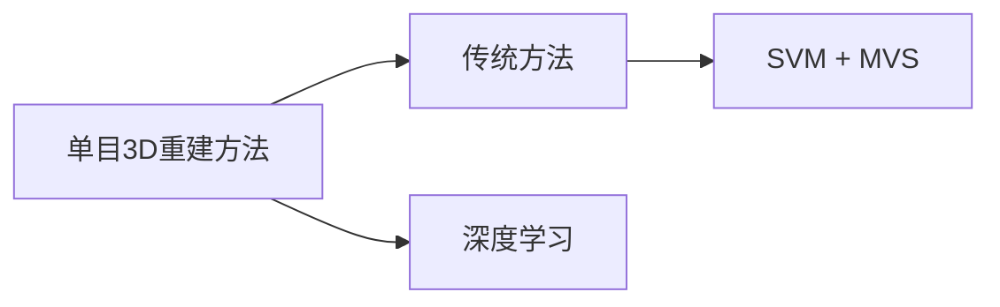

---
tags:
  - "#3D-construction"
  - "#monocular-vision"
---
**Pipeline Inner Surface 3D Reconstruction and Depth Prediction Based on Fast-MVSNet for Intelligent Sewer Robot Vision**

---

因此，本文结合传统与深度学习方法，利用管道机器人单目视频研究三维重建和深度预测方法。

>[!note]
>在稀疏三维重建阶段使用传统的 ORB-SLAM3 算法，在稠密三维重建阶段采用深度学习方法。

由于 ORB-SLAM3 利用特征匹配获得的特征点重建三维环境，因此所得点云往往较为稀疏。为了实现更接近真实三维世界的点云密度，必须使用多视角立体（MVS）技术来估算图像中每个像素的深度值。

> [!note]
> 多视角立体（MVS）就是一种传统的稠密重建算法，已知各个视图之间的相当位姿和相机内参进行稠密重建，这篇论文用一种基于深度学习的方法 Fast-MVSNet。

![[Pasted image 20261003115517.png]]

总结：这篇论文本质上是想通过单目相机解决管道内部三维重建的任务，其最严重的问题是三维重建往往需要机器人行走完后进行离线的优化和重建，和实时性强的清淤任务冲突。

