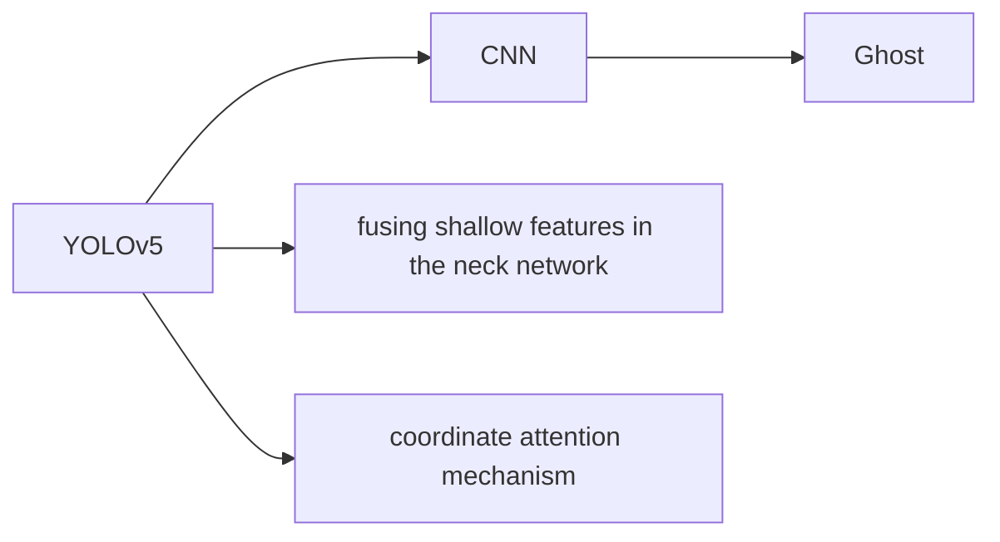

---
tags:
  - lightweighting
  - "#yolo"
  - attention
  - "#defect-detection"
  - "#cross-scale-feature"
---

传统的卷积操作会产生大量的冗余特征图，这些特征图会产生包含许多相似的部分，删除这些冗余的部分会使得精度下降在可控的范围之内的同时，提升算法的运行速率。

*Compared with other lightweight networks such as MobileNet and ShuffleNet, GhostNet has better detection performance and can significantly reduce the computational cost required for ordinary convolutions while maintaining detection accuracy stability.*

