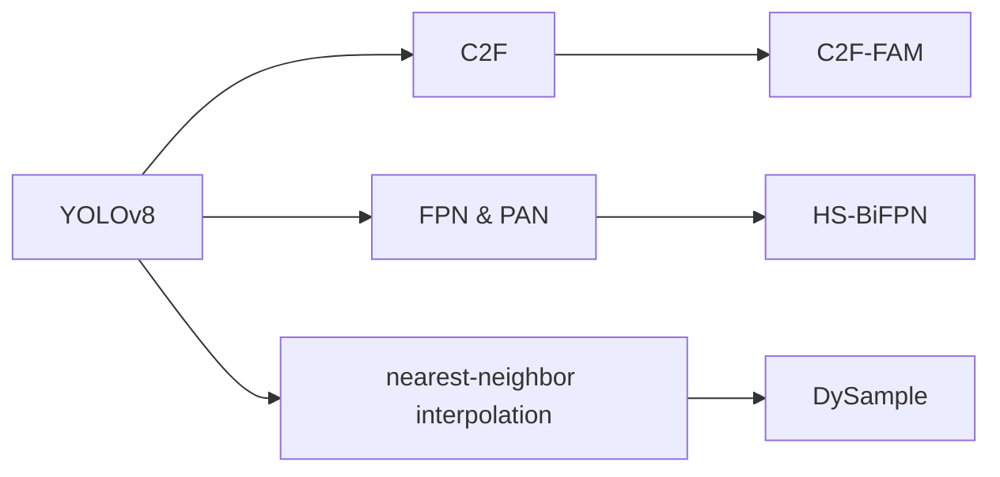

---
tags:
  - defect-detection
  - lightweighting
  - "#yolo"
  - "#cross-scale-feature"
---
**A lightweight cross-scale feature fusion model based on YOLOv8 for defect detection in sewer pipeline**

---

Although the above methods have made some progress, there are still several **limitations.** **First,** sewer pipe images often exhibit complex backgrounds and diverse defect types. Common defects such as cracks and deposits typically have blurred boundaries and are easily confused with the background, leading to the loss of critical semantic information during feature extraction.**Second,** although some models have improved detection accuracy, their complex network architectures and excessive parameter counts make them unsuitable for deployment on resource-constrained embedded devices.**Third,** existing approaches suffer from inadequate multi-scale feature fusion and limited cross-layer semantic expression, which restricts the model’s ability to accurately detect objects at different scales and with ambiguous boundaries.**To address these challenges, ...**

>[!note]
>指出管道缺陷检测领域的当前的局限：
>- 复杂的背景和多种缺陷类型，导致缺陷丢失。
>- 算法复杂度高，计算开销大。
>- 多尺度特征融合方面不足，跨层语义表达有限。（**这一点的对应不太对吧，前两点都是实际的问题，最后一点应该点出多尺度特征融合不足，跨层语义表达有限带来的实际问题是啥？**）

对应的以传统 YOLOv8 视觉检测算法为基线，提出对应的三点改进：

