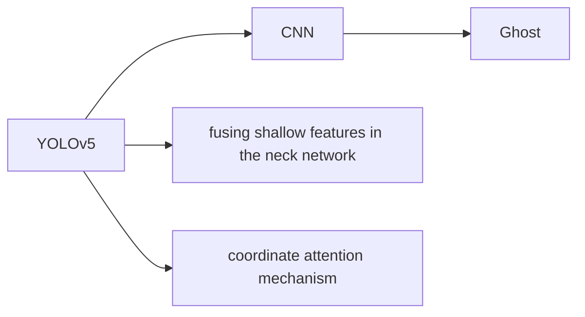

---
tags:
  - lightweighting
  - "#yolo"
  - attention
  - "#defect-detection"
  - "#cross-scale-feature"
---

```mermaid
graph LR
A[YOLOv5] --> B1[CNN] --> B2[Ghost]
A --> C1[fusing shallow features in the neck network]
A --> D1[coordinate attention mechanism]

```
