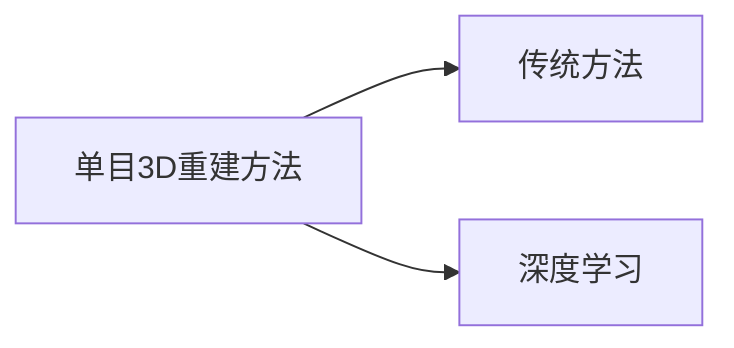

---
tags:
  - "#3D-construction"
  - "#monocular-vision"
---
**Pipeline Inner Surface 3D Reconstruction and Depth Prediction Based on Fast-MVSNet for Intelligent Sewer Robot Vision**

---

因此，本文结合传统与深度学习方法，利用管道机器人单目视频研究三维重建和深度预测方法。