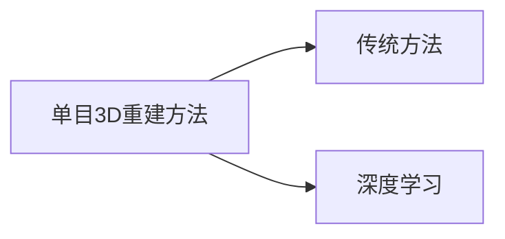

---
tags:
  - "#3D-construction"
  - "#monocular-vision"
---
**Pipeline Inner Surface 3D Reconstruction and Depth Prediction Based on Fast-MVSNet for Intelligent Sewer Robot Vision**

---

因此，本文结合传统与深度学习方法，利用管道机器人单目视频研究三维重建和深度预测方法。

由于 ORB-SLAM3 利用特征匹配获得的特征点重建三维环境，因此所得点云往往较为稀疏。为了实现更接近真实三维世界的点云密度，必须使用多视角立体（MVS）技术来估算图像中每个像素的深度值。

> [!note]
> 多视角立体